# Hướng Dẫn Step-by-Step Triển Khai và Nghiệm Thu Lab 1 & 2

Tài liệu này ghi lại chi tiết toàn bộ các bước từ lúc cấu hình, triển khai (deployment) cho đến các bước gõ lệnh để nghiệm thu kết quả, giúp bạn dễ dàng theo dõi tiến trình và hiểu rõ bản chất.

---

## PHẦN CHUẨN BỊ CHUNG: KHỞI TẠO HỆ THỐNG GITOPS

**Bước 1: Khởi động Minikube (Chỉ làm nếu cụm chưa chạy)**
```bash
minikube start -p w10 --driver=docker
kubectl config use-context w10
```

**Bước 2: Đảm bảo ArgoCD đã được cài đặt và đang chạy**
```bash
kubectl get pods -n argocd
# Nếu thấy các pod Running hết là OK.
```

**Bước 3: Khởi chạy mô hình App-of-Apps để tự động triển khai hạ tầng**
Chúng ta sử dụng ArgoCD để tự động hoá toàn bộ quá trình áp dụng YAML thay vì phải gõ thủ công. Chạy file cấu hình gốc:
```bash
kubectl apply -f argocd/root.yaml
```
*Ghi chú: Lệnh này sẽ yêu cầu ArgoCD tự động đọc Github của bạn và cài đặt toàn bộ 8 ứng dụng: `rbac`, `gatekeeper`, `gatekeeper-policies`, `api`, `external-secrets`, `eso-config`, `policy-controller`, `image-policies`.*

**Bước 4: Mở giao diện ArgoCD để kiểm tra**
- Mở terminal phụ gõ: `kubectl port-forward svc/argocd-server -n argocd 8080:443`
- Truy cập `https://localhost:8080` (admin/mật khẩu xem bằng lệnh: `kubectl -n argocd get secret argocd-initial-admin-secret -o jsonpath="{.data.password}" | base64 -d`)
- Đợi cho đến khi TẤT CẢ các thẻ App đều xanh lá (Healthy & Synced).
- 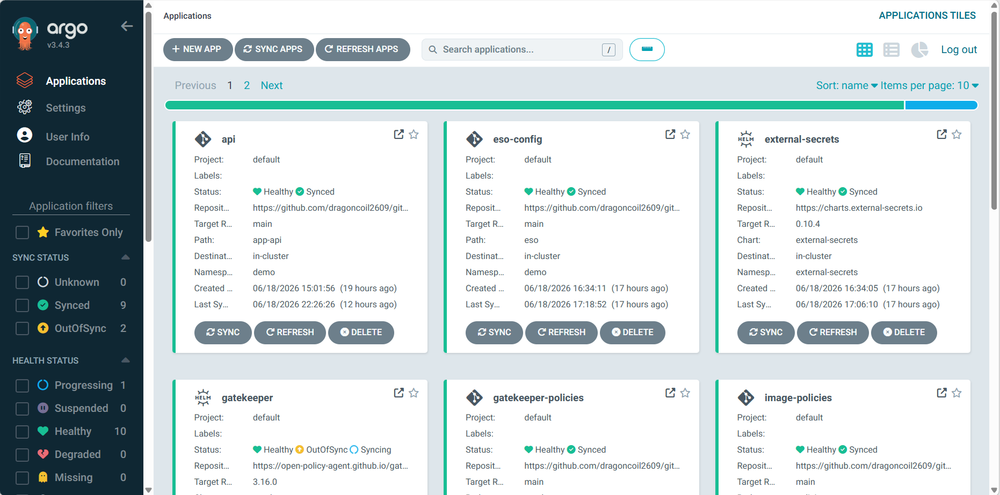

---

## BÀI 1: LAB 1 (RBAC & OPA GATEKEEPER)

### 1.1 Triển khai và Nghiệm thu K8s RBAC

**A. Các bước triển khai (Implementation):**

**1. Khai báo các Nhóm Quyền (Role / ClusterRole):**
Chúng ta khai báo các nhóm quyền hạn cụ thể trong file `rbac/roles.yaml`. Ở đây hệ thống đã định nghĩa 3 cấp độ quyền cho 3 nhân vật: `alice` (developer), `bob` (SRE) và `carol` (viewer). Ví dụ đoạn code cấp quyền tạo/xoá Deployment cho Alice:
```yaml
# Quyền cho Alice (Developer) - Chỉ trong namespace demo
apiVersion: rbac.authorization.k8s.io/v1
kind: Role
metadata:
  namespace: demo
  name: developer
rules:
- apiGroups: ["", "apps"]
  resources: ["pods", "services", "deployments", "replicasets"]
  verbs: ["create", "delete", "get", "list", "patch", "update", "watch"]
```

**2. Gắn Quyền cho User (RoleBinding / ClusterRoleBinding):**
Sau khi có Role, ta gắn Role đó cho user thông qua `RoleBinding` trong file `rbac/rolebindings.yaml`. Ví dụ gắn quyền `developer` cho user `alice`:
```yaml
# Gắn Role 'developer' cho user 'alice'
apiVersion: rbac.authorization.k8s.io/v1
kind: RoleBinding
metadata:
  name: alice-developer
  namespace: demo
subjects:
- kind: User
  name: alice
  apiGroup: rbac.authorization.k8s.io
roleRef:
  kind: Role
  name: developer
  apiGroup: rbac.authorization.k8s.io
```

**3. Triển khai tự động:**
Git commit & push. Ứng dụng ArgoCD (App `rbac`) sẽ tự động theo dõi repo và Apply các cấu hình bảo mật này vào cụm Kubernetes.

**B. Các bước test (Verification):**
**Mục tiêu:** Chứng minh hệ thống đã áp dụng các luật phân quyền (chỉ cho xem, không cho xóa).
```bash
# Lệnh 1: Kiểm tra quyền TẠO deployment trong demo của alice (Sẽ trả về yes)
kubectl auth can-i create deploy -n demo --as alice

# Lệnh 2: Kiểm tra quyền XEM pod trên toàn cluster của bob (Sẽ trả về yes)
kubectl auth can-i get pods -A --as bob

# Lệnh 3: Kiểm tra quyền XÓA node của carol (Sẽ trả về no)
kubectl auth can-i delete nodes --as carol
```
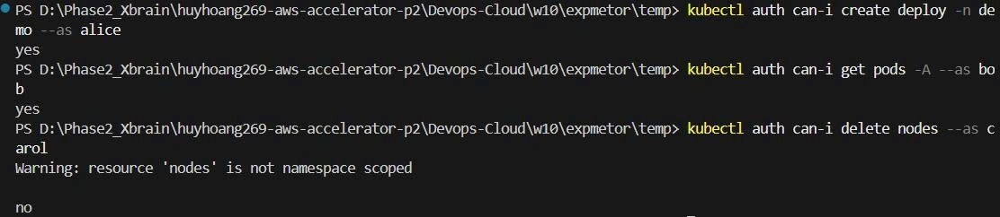

---

### 1.2 Triển khai và Nghiệm thu OPA Gatekeeper

**A. Các bước triển khai:**

**1. Khai báo Logic (ConstraintTemplate):**
Chúng ta sử dụng ngôn ngữ Rego để viết logic kiểm tra. Ví dụ đoạn code cốt lõi trong `gatekeeper/templates/k8sdisallowedtags.yaml` định nghĩa logic bắt lỗi nếu dùng tag `:latest`:
```yaml
apiVersion: templates.gatekeeper.sh/v1
kind: ConstraintTemplate
metadata:
  name: k8sdisallowedtags
spec:
  crd:
    spec:
      names:
        kind: K8sDisallowedTags
  targets:
    - target: admission.k8s.gatekeeper.sh
      rego: |
        package k8sdisallowedtags
        violation[{"msg": msg}] {
            container := input.review.object.spec.containers[_]
            tags := [tag_with_prefix | tag := input.parameters.tags[_]; tag_with_prefix := concat(":", ["", tag])]
            strings.any_suffix_match(container.image, tags)
            msg := sprintf("container <%v> uses a disallowed tag <%v>", [container.name, container.image])
        }
```

**2. Khai báo Luật (Constraint):**
Dựa trên Template trên, chúng ta tạo ra một luật áp dụng cụ thể vào hệ thống. Ví dụ file `gatekeeper/constraints/1-block-latest-tag.yaml`:
```yaml
apiVersion: constraints.gatekeeper.sh/v1beta1
kind: K8sDisallowedTags
metadata:
  name: block-latest-tag
spec:
  match:
    kinds:
      - apiGroups: [""]
        kinds: ["Pod"]
    excludedNamespaces: ["kube-system", "argocd", "gatekeeper-system"]
  parameters:
    tags:
      - latest
```

**3. Triển khai tự động:**
Git commit & push. ArgoCD sẽ tự động triển khai thông qua App `gatekeeper-policies`. Gatekeeper Admission Webhook từ nay sẽ đóng vai trò như bảo vệ cổng, rà quét mọi Pod mới tạo.

**B. Các bước test:**
**Mục tiêu:** Chứng minh Gatekeeper đang theo dõi và chặn đứng các cấu hình nguy hiểm theo 4 bộ luật đã đề ra.

**Test Luật 1: Cấm sử dụng image tag :latest**
```bash
kubectl run test-latest-tag --image=nginx:latest -n demo
# Kết quả mong đợi: Bị chặn (DENIED) bởi block-latest-tag.
```
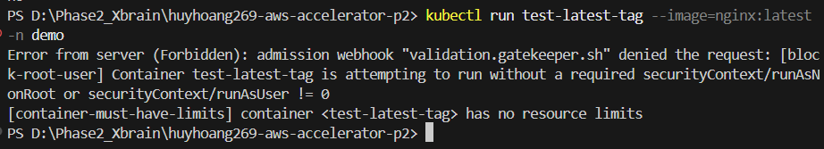

**Test Luật 2: Bắt buộc giới hạn tài nguyên Container**
```bash
kubectl run test-limits --image=nginx:1.21 -n demo
# Kết quả mong đợi: Bị chặn (DENIED) bởi container-must-have-limits.
```
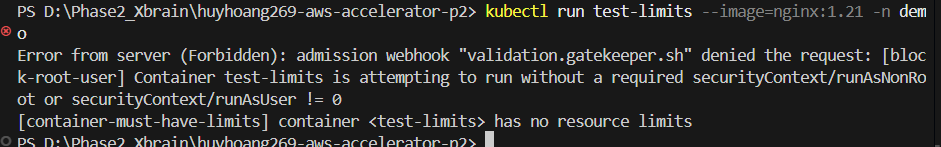

**Test Luật 3: Cấm chạy Pod với quyền Root (runAsUser: 0)**
```bash
kubectl apply -f Devops-Cloud\w10\expmetor\temp\test3-root-pod.yaml
# Kết quả mong đợi: Bị chặn (DENIED) bởi block-root-user.
```
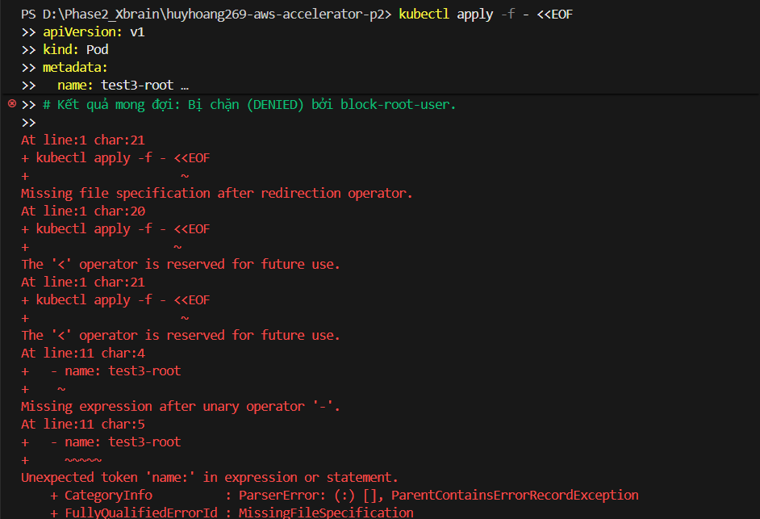

**Test Luật 4: Cấm tạo Service kiểu NodePort**
```bash
kubectl create service nodeport test-svc --tcp=80:80 -n demo
# Kết quả mong đợi: Bị chặn (DENIED) bởi block-nodeport-services.
```
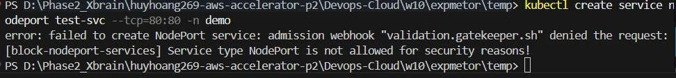

---

## BÀI 2: LAB 2 (ESO & SUPPLY CHAIN SECURITY)

### 2.1 Triển khai và Nghiệm thu External Secrets Operator (ESO)

**A. Các bước triển khai:**

**1. Cấu hình Cổng kết nối (SecretStore):**
Chúng ta khai báo `SecretStore` đóng vai trò là cầu nối tới kho lưu trữ thật (như AWS Secrets Manager, Vault, hoặc Fake provider cho mục đích test) tại file `eso/secret-store.yaml`:
```yaml
apiVersion: external-secrets.io/v1beta1
kind: SecretStore
metadata:
  name: fake-provider
  namespace: demo
spec:
  provider:
    fake:
      data:
        - key: "db-password"
          value: "super-secret-v1"
          version: "v1"
```

**2. Ánh xạ dữ liệu (ExternalSecret):**
Định nghĩa `ExternalSecret` tại file `eso/external-secret.yaml` để lấy dữ liệu từ `SecretStore` và tự động sinh ra K8s Native Secret (tên là `app-db-secret`). Tham số `refreshInterval: 15s` đảm bảo K8s tự động polling cập nhật liên tục:
```yaml
apiVersion: external-secrets.io/v1beta1
kind: ExternalSecret
metadata:
  name: db-credentials
  namespace: demo
spec:
  refreshInterval: 15s # Đồng bộ siêu nhanh để pass bài Lab (<60s)
  secretStoreRef:
    name: fake-provider
    kind: SecretStore
  target:
    name: app-db-secret # Tên K8s Secret sẽ được tạo ra
  data:
    - secretKey: password # Key trong K8s Secret
      remoteRef:
        key: "db-password" # Key tương ứng bên Fake Provider
        version: "v1"
```

**3. Triển khai tự động:**
Git commit & push. ArgoCD sẽ tự động theo dõi và deploy toàn bộ cấu hình ESO này thông qua App `eso-config`.

**B. Các bước test:**
**Mục tiêu:** Đồng bộ Secret tự động (< 60s) mà KHÔNG làm khởi động lại Pod.

**Bước 1: Đọc Secret hiện tại trên K8s**
```bash
kubectl get secret app-db-secret -n demo -o jsonpath="{.data.password}" | base64 -d
# Kết quả: super-secret-v1
```

**Bước 2: Thay đổi dữ liệu nguồn và quan sát**
1. Mở file `eso/secret-store.yaml` trên code editor.
2. Sửa dòng `value: "super-secret-v1"` thành `value: "super-secret-v2"`.
3. Git commit -m "update secret" và git push.
4. Đợi khoảng 15-30 giây, chạy lại lệnh ở Bước 1. Bạn sẽ thấy kết quả nhảy thành `super-secret-v2`.

**Bước 3: Chứng minh Pod không bị Restart**
```bash
kubectl get pods -n demo
```
- Quan sát cột `AGE`. Thời gian chạy của Pod không hề bị reset về `0s` mặc dù Secret bên trong nó đã được cập nhật bản mới nhất.
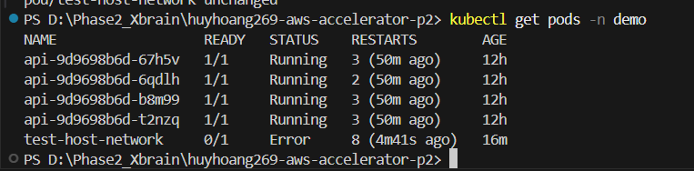

---

### 2.2 Triển khai và Nghiệm thu Trivy + Cosign + Policy Controller

**A. Các bước triển khai CI/CD & Cluster:**

**1. Tích hợp Quét & Ký tự động trên CI (GitHub Actions):**
Chúng ta khai báo các Job quét lỗ hổng bằng Trivy và ký số bằng Cosign trong file `.github/workflows/build-push.yml`. Nếu Trivy quét ra lỗi `CRITICAL` hoặc `HIGH`, pipeline sẽ tự động bị chặn. Nếu qua được, Cosign sẽ dùng Private Key lấy từ Github Secrets để ký lên Image:
```yaml
      - name: Run Trivy vulnerability scanner
        uses: aquasecurity/trivy-action@master
        with:
          image-ref: '${{ env.REGISTRY }}/${{ env.IMAGE_NAME }}:${{ steps.semver.outputs.version }}'
          format: 'table'
          exit-code: '1' # Cố tình set exit-code = 1 để block CI nếu có lỗi
          ignore-unfixed: true
          vuln-type: 'os,library'
          severity: 'CRITICAL,HIGH'

      - name: Install Cosign
        uses: sigstore/cosign-installer@v3.5.0

      - name: Sign the published Docker image
        env:
          COSIGN_PASSWORD: ${{ secrets.COSIGN_PASSWORD }}
          COSIGN_PRIVATE_KEY: ${{ secrets.COSIGN_PRIVATE_KEY }}
        run: cosign sign --key env://COSIGN_PRIVATE_KEY -y ${{ env.REGISTRY }}/${{ env.IMAGE_NAME }}:${{ steps.semver.outputs.version }}
```

**2. Khai báo Khóa trên GitHub:** 
Tạo cặp khóa bí mật bằng công cụ Cosign:
```bash
cosign generate-key-pair
```
*Lưu ý: Lệnh này sẽ yêu cầu nhập mật khẩu bảo vệ khóa (ví dụ: `lab2-password`) và sinh ra 2 file:*
- `cosign.pub`: Khóa công khai. Dùng để dán vào file `policies/cluster-image-policy.yaml` bên dưới.
- `cosign.key`: Khóa bí mật. Mở file này (bằng Notepad/VS Code hoặc `cat`), copy toàn bộ văn bản bên trong.

Tiếp theo, vào Github Repo > **Settings > Secrets and variables > Actions > New repository secret** để khai báo 2 biến:
- Tên `COSIGN_PRIVATE_KEY`: Dán toàn bộ nội dung file `cosign.key` vừa copy.
- Tên `COSIGN_PASSWORD`: Nhập lại mật khẩu bảo vệ khóa (ví dụ: `lab2-password`).

**3. Bật rào chắn kiểm tra chữ ký trên K8s Cluster:**
Triển khai Sigstore Policy Controller lên cụm K8s và tạo file `policies/cluster-image-policy.yaml` chứa **Public Key**. Khi có bất kỳ yêu cầu tạo Pod nào mang dải image cần giám sát, hệ thống sẽ đối chiếu chữ ký của Image đó với Public Key này. Nếu không khớp hoặc không có chữ ký, Pod sẽ bị từ chối:
```yaml
apiVersion: policy.sigstore.dev/v1alpha1
kind: ClusterImagePolicy
metadata:
  name: image-policy
spec:
  images:
    - glob: "ghcr.io/dragoncoil2609/w10-api*" # Dải image cần kiểm tra chữ ký
  authorities:
    - key:
        data: |
          -----BEGIN PUBLIC KEY-----
          MFkwEwYHKoZIzj0CAQYIKoZIzj0DAQcDQgAE9rRF8EiUzqs5cUWiGHkhc/9ztryL
          VIh4QUUxGGIlsETlB540XwnNwQaAEk5RJWfWAm60EvPkWgW4u0pLnwBpsw==
          -----END PUBLIC KEY-----
```

**B. Các bước test:**
**Mục tiêu:** Quét lỗ hổng, Ký điện tử image trên CI và chặn image lậu trên Cluster.

**Bước 1: Kiểm chứng quy trình CI tự động quét và ký**
1. Sửa file code bất kỳ (vd: chỉnh version trong `app-api/rollout.yaml`), commit & push lên main.
2. Mở tab **Actions** trên GitHub, chờ tiến trình hoàn tất và chụp ảnh kết quả của Trivy/Cosign.
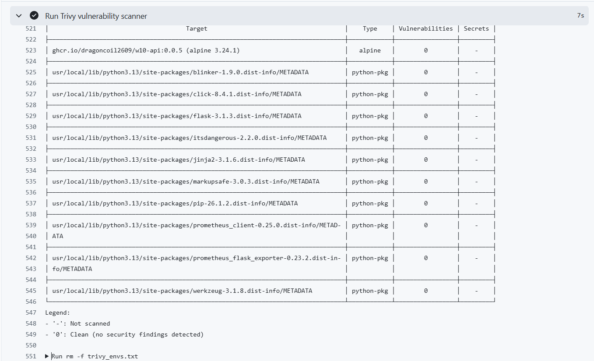
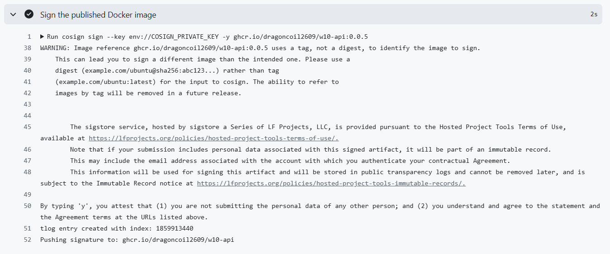

**Bước 2: Bật kiểm duyệt Image trên Cluster**
Dán nhãn bảo vệ vào namespace `demo` để kích hoạt luật của Policy Controller:
```bash
kubectl label namespace demo policy.sigstore.dev/include=true
```

**Bước 3: Deploy thử một Image giả mạo (Không có chữ ký)**
```bash
kubectl run test-unsigned --image=nginx:1.21 -n demo
```
* Kết quả mong đợi: Bị chặn lại với lỗi `validation failed: no matching signatures...`.
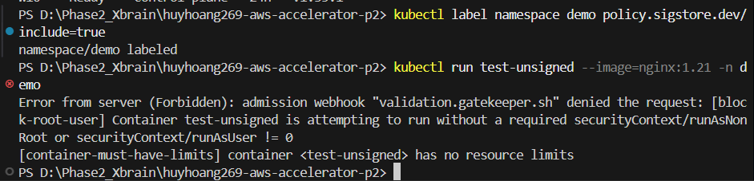

---

## TAKE-HOME CHALLENGE: CÔ LẬP TEAM "PAYMENTS"

### Triển khai và Nghiệm thu

**A. Các bước triển khai (Cô lập tài nguyên & mạng):**

**1. Khởi tạo Namespace & ArgoCD App:** 
Tổ chức thư mục `tenants/payments/` chứa tài nguyên hạ tầng và `apps/payments/` chứa file YAML workload của team. Tạo ứng dụng GitOps `payments-tenant` và `payments-app` trên ArgoCD để đồng bộ cấu hình tự động.

**2. Phân quyền RBAC (Chỉ quản lý nội bộ):**
Định nghĩa Role và RoleBinding dành cho user `payments-dev` trong file `tenants/payments/rbac.yaml`. User này chỉ được phép tạo/sửa/xóa các tài nguyên bên trong Namespace `payments`, tuyệt đối không thể chạm vào các namespace khác như `demo`:
```yaml
apiVersion: rbac.authorization.k8s.io/v1
kind: Role
metadata:
  namespace: payments
  name: payments-dev-role
rules:
- apiGroups: ["", "apps"]
  resources: ["pods", "services", "deployments", "replicasets"]
  verbs: ["create", "delete", "get", "list", "patch", "update", "watch"]
```

**3. Giới hạn Tài nguyên (Resource Quota & LimitRange):**
Chống việc team Payments "ăn" hết tài nguyên của Cluster bằng cách áp dụng `ResourceQuota` và `LimitRange` trong file `tenants/payments/quota.yaml`. Ví dụ chặn tổng RAM tối đa của team không vượt quá `2Gi`:
```yaml
apiVersion: v1
kind: ResourceQuota
metadata:
  name: payments-quota
  namespace: payments
spec:
  hard:
    requests.cpu: "1"
    requests.memory: 1Gi
    limits.cpu: "2"
    limits.memory: 2Gi
```

**4. Cô lập Mạng (Network Policy Zero-Trust):**
Viết chính sách bảo mật mạng trong file `tenants/payments/netpol.yaml`. Cấu hình cấm mọi truy cập đầu vào (`default-deny-ingress`) và chỉ cho phép truy cập đầu ra (Egress) tới nội bộ namespace `payments` hoặc phân giải DNS (DNS port 53 trên `kube-system`):
```yaml
apiVersion: networking.k8s.io/v1
kind: NetworkPolicy
metadata:
  name: allow-same-ns-and-dns-egress
  namespace: payments
spec:
  podSelector: {}
  policyTypes:
  - Egress
  egress:
  - to:
    - namespaceSelector:
        matchLabels:
          kubernetes.io/metadata.name: payments
  - to:
    - namespaceSelector:
        matchLabels:
          kubernetes.io/metadata.name: kube-system
    ports:
    - protocol: UDP
      port: 53
```

**5. Triển khai tự động:**
Git commit & push. ArgoCD sẽ lập tức đưa các chính sách cô lập cực kỳ nghiêm ngặt này vào cụm Kubernetes.

**B. Các bước test:**
**Mục tiêu:** Chứng minh hệ thống đã cấu hình không gian riêng cho team payments, có giới hạn tài nguyên, cô lập mạng và áp dụng đầy đủ Guardrail.

**Việc 1: Chứng minh RBAC Cô Lập (Least-privilege)**
```bash
# Lệnh 1: Kiểm tra quyền TẠO deployment trong payments (Sẽ trả về yes)
kubectl auth can-i create deployments -n payments --as payments-dev

# Lệnh 2: Kiểm tra quyền ĐỌC secret trong payments (Sẽ trả về no)
kubectl auth can-i get secrets -n payments --as payments-dev

# Lệnh 3: Kiểm tra quyền sang namespace demo (Sẽ trả về no)
kubectl auth can-i create deployments -n demo --as payments-dev
```

**Việc 2: Chứng minh Resource Quota**
```bash
# Tạo một Pod xin 5000 RAM (vượt ngân sách cấp phép)
kubectl run test-quota --image=nginx -n payments --requests=memory=5000Mi
# Kết quả mong đợi: Báo lỗi "forbidden: exceeded quota..."
```

**Việc 3: Chứng minh Cô Lập NetworkPolicy (Ngăn không cho gọi chéo)**
```bash
# Lấy tên của Pod ứng dụng đang chạy trong namespace payments
POD_NAME=$(kubectl get pods -n payments -o jsonpath='{.items[0].metadata.name}')

# Gọi wget từ bên trong Pod đó sang service API của demo
kubectl exec -it $POD_NAME -n payments -- wget -qO- --timeout=5 http://api.demo.svc.cluster.local:8080/healthz

# Kết quả mong đợi: Lệnh sẽ bị treo và báo lỗi "wget: download timed out" (Tức là bị chặn)
```

**Việc 4: Bằng chứng ArgoCD & Gatekeeper Guardrail**
1. Mở giao diện ArgoCD, chụp ảnh 2 app `payments-tenant` và `payments-app` đồng bộ xanh lá.
2. Ứng dụng `payments-app` vẫn vượt qua cửa ải Gatekeeper để chạy thành công vì Namespace `payments` tự động kế thừa (inherit) toàn bộ luật chặn Root, chặn Latest Tag từ ban đầu.

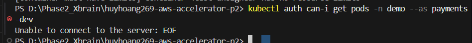
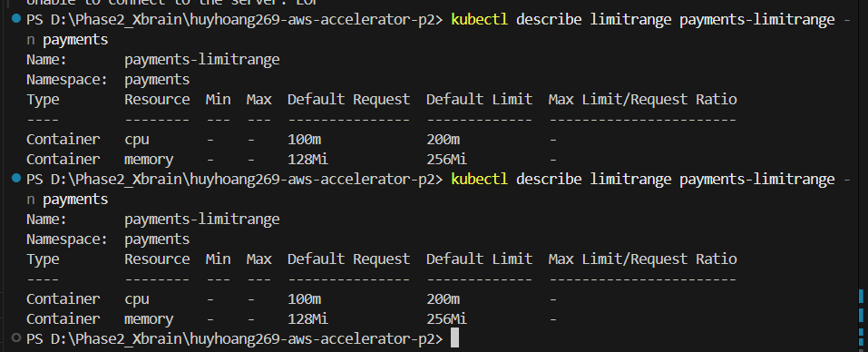
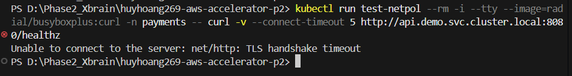
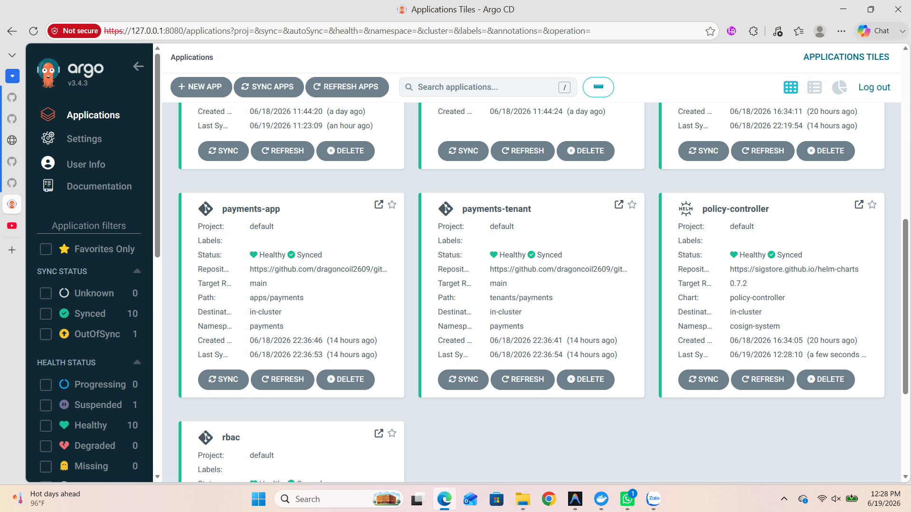
