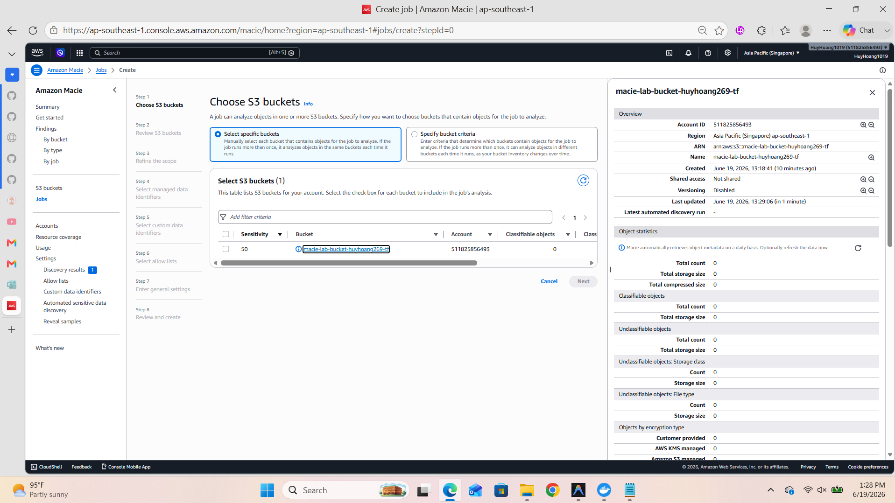
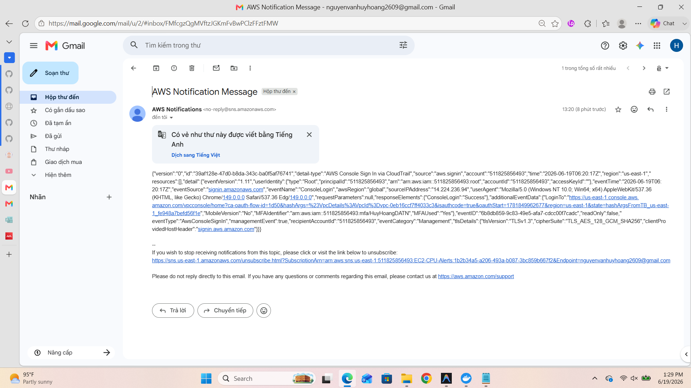

# Lab: Detect Sensitive Data in Amazon S3 Buckets using Amazon Macie

## Tổng quan Kiến trúc (Architecture)
1. Tạo một S3 Bucket và tải lên các file chứa dữ liệu nhạy cảm (Sample files).
2. Kích hoạt Amazon Macie và tạo Job để quét cái S3 Bucket đó.
3. Khi Macie phát hiện dữ liệu nhạy cảm, nó sẽ tạo ra các Cảnh báo (Findings).
4. Amazon EventBridge bắt các sự kiện (Findings) này và tự động kích hoạt một Rule.
5. EventBridge chuyển tiếp cảnh báo tới Amazon SNS.
6. Amazon SNS gửi Email cảnh báo (Alerts on Email) trực tiếp cho bạn.

---

## Các Bước Triển Khai Trên AWS Console

### Bước 1: Chuẩn bị Dữ liệu và S3 Bucket
1. Mở Notepad trên máy tính, tạo một file tên là `sensitive-data.txt`. Viết vào đó một vài số Thẻ Tín Dụng giả hoặc số Passport giả (Bạn có thể lên mạng search "fake credit card generator" để lấy số). Lưu file lại.
2. Đăng nhập vào AWS Management Console, tìm dịch vụ **S3**.
3. Nhấn **Create bucket**, đặt một cái tên không đụng hàng (ví dụ: `macie-lab-bucket-hoang-123`), để mọi cấu hình mặc định và nhấn **Create bucket**.
4. Bấm vào Bucket vừa tạo, nhấn **Upload** và tải file `sensitive-data.txt` lên.

### Bước 2: Kích hoạt Amazon Macie
1. Tìm dịch vụ **Macie** trên AWS Console.
2. Nhấn **Get started**, sau đó chọn **Enable Macie**. 

### Bước 3: Cấu hình Gửi Email qua Amazon SNS
1. Tìm dịch vụ **Simple Notification Service (SNS)**.
2. Mở menu bên trái, chọn **Topics** -> **Create topic**.
   - Type: **Standard**
   - Name: `Macie-Alert-Topic`
   - Kéo xuống dưới cùng nhấn **Create topic**.
3. Tại trang của topic vừa tạo, chuyển sang tab **Subscriptions** -> Nhấn **Create subscription**.
   - Protocol: Chọn **Email**
   - Endpoint: Nhập **địa chỉ Email thật** của bạn vào đây.
   - Nhấn **Create subscription**.
4. ⚠️ **Rất quan trọng:** Mở hộp thư Email của bạn ra, tìm bức thư từ AWS Notifications, mở ra và click vào link **Confirm subscription**.

### Bước 4: Cấu hình Tự động hóa bằng Amazon EventBridge
1. Tìm dịch vụ **Amazon EventBridge**.
2. Ở menu bên trái, chọn **Rules** -> **Create rule**.
   - Name: `Macie-Finding-To-SNS`
   - Rule type: **Rule with an event pattern**
   - Nhấn **Next**.
3. Phần **Event pattern**:
   - Event source: Chọn **AWS services**
   - AWS service: Kéo tìm chữ **Macie**
   - Event type: Chọn **Macie Finding**
   - Nhấn **Next**.
4. Phần **Target 1**:
   - Target types: Chọn **AWS service**
   - Select a target: Tìm chữ **SNS topic**
   - Topic: Chọn tên Topic `Macie-Alert-Topic` mà bạn tạo ở Bước 3.
   - Kéo xuống cuối nhấn **Next** liên tục rồi nhấn **Create rule**.

### Bước 5: Chạy Job Quét Dữ Liệu trên Macie
1. Quay lại dịch vụ **Amazon Macie**.
2. Ở thanh menu bên trái, chọn **S3 buckets**.
3. Tích chọn vào cái bucket `macie-lab-bucket-hoang-123` của bạn. Sẽ có một thanh nổi lên, nhấn **Create job**.
4. Đặt tên Job là `Scan-Sensitive-Data`. Cứ nhấn **Next** liên tục để dùng cấu hình mặc định (Quét 1 lần, quét toàn bộ).
5. Cuối cùng nhấn **Submit**.
6. Lúc này Job sẽ bắt đầu chạy. Trạng thái sẽ là *Running*. Bạn sẽ cần chờ khoảng **5 đến 10 phút** để nó quét xong file.

---

## Kết Quả Nghiệm Thu (Evidence)

Sau khoảng 10 phút, khi Job chạy xong, bạn sẽ thấy kết quả:

### 1. Bằng chứng phát hiện dữ liệu nhạy cảm trên Macie
- Mở dịch vụ **Macie** -> Chọn tab **Findings** ở bên trái.
- Bạn sẽ thấy một danh sách các cảnh báo màu vàng/đỏ ghi chữ `SensitiveData:S3Object...`.
- **👉 HÀNH ĐỘNG:** Chụp ảnh toàn bộ màn hình này lưu lại thành `macie-finding.png`.

### 2. Bằng chứng nhận được Email Cảnh Báo
- Mở **Hộp thư Email** của bạn ra. Bạn sẽ thấy một lô lốc email tự động gửi từ AWS mang tên "AWS Notification Message".
- Mở một bức email ra, bên trong là một cục code JSON chứa toàn bộ thông tin báo cáo của Macie về cái file bị lộ thẻ tín dụng.
- **👉 HÀNH ĐỘNG:** Chụp ảnh bức thư email đó lưu lại thành `macie-email-alert.png`.

