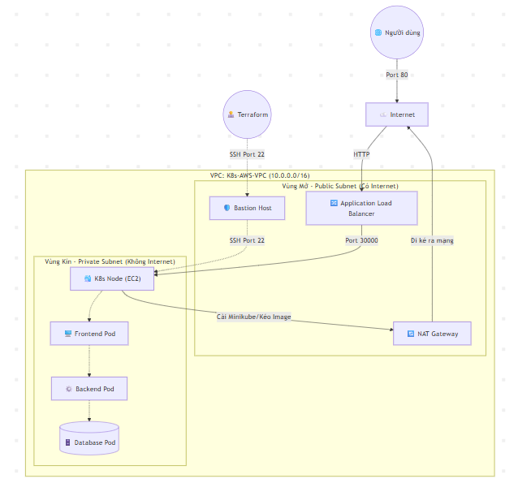
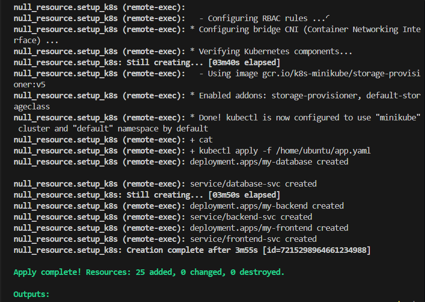
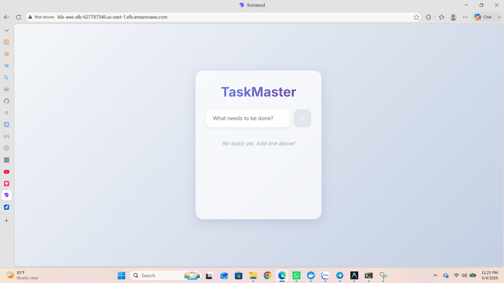
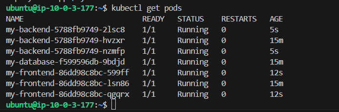

# 🚀 BÍ KÍP TRIỂN KHAI K8S TRÊN AWS (CHUẨN PRODUCTION)

> [!IMPORTANT]  
> **Mục tiêu bài Lab:** Xây dựng hệ thống tự động hóa 100% bằng Terraform để triển khai cụm Kubernetes (Minikube) chạy mô hình 3 lớp (Database - Backend - Frontend) hoàn toàn nằm trong mạng nội bộ (Private Subnet) siêu bảo mật.

---

## 🏗️ 1. SƠ ĐỒ KIẾN TRÚC MẠNG (ARCHITECTURE FLOW)

Hệ thống được chia làm 2 phân vùng mạng rõ rệt để đảm bảo an ninh tối đa:



> [!TIP]
> **Tại sao cần NAT Gateway và Bastion Host?**
> Vì K8s Node nằm trong Vùng Kín (Private Subnet) nên không có Public IP. 
> - Cần **NAT Gateway** để K8s Node có thể "đi ké" ra Internet tải Docker/Minikube.
> - Cần **Bastion Host** để Terraform có thể SSH làm bàn đạp chui vào K8s Node cài đặt.

---

## 🔄 2. LUỒNG DỮ LIỆU BÊN TRONG K8S (TRAFFIC FLOW)

Khi 1 Request từ Internet đi vào hệ thống, nó sẽ trải qua các bước sau:

| Bước | Thành phần | Mô tả |
|---|---|---|
| 1️⃣ | **Internet ➔ ALB** | User gọi vào địa chỉ miền của Load Balancer qua cổng `80` (HTTP). |
| 2️⃣ | **ALB ➔ K8s Node** | ALB nhận diện và đẩy traffic xuyên tường lửa vào `Private IP` của K8s Node qua cổng `30000`. |
| 3️⃣ | **K8s Node ➔ Frontend**| Minikube nhận lệnh ở cổng `30000` (NodePort) và đẩy vào `Frontend Pod` (Cổng `80`). |
| 4️⃣ | **Frontend ➔ Backend** | FE xử lý giao diện, gọi API của BE thông qua tên nội bộ `backend-svc:5000` (ClusterIP). |
| 5️⃣ | **Backend ➔ Database** | BE gọi xuống DB để lấy dữ liệu thông qua tên nội bộ `database-svc:3306` (ClusterIP). |

> [!NOTE]  
> Các Service dạng **ClusterIP** (Database, Backend) là hoàn toàn vô hình với bên ngoài, chỉ có các Pod trong cụm K8s mới nhìn thấy nhau.

---

## 🛠️ 3. CÁC BƯỚC THỰC HIỆN BẰNG TERRAFORM

Quá trình xây dựng hạ tầng được chia nhỏ vào các file `.tf` để dễ quản lý.

| File cấu hình | Chức năng chính | Trạng thái |
|---|---|:---:|
| `providers.tf` | 📦 Khai báo các công cụ sẽ dùng (`aws`, `tls`, `local`, `null`). | ✅ |
| `network.tf` | 🌐 Tạo lưới điện: `VPC`, `Subnets`, `IGW`, `NAT Gateway`, `Route Tables` & `Security Groups`. | ✅ |
| `main.tf` | 💻 Tạo máy chủ `Bastion`, `K8s Node`, SSH keys và **chạy kịch bản 1-Click** cài K8s + Deploy App. | ✅ |
| `alb.tf` | 🔀 Tạo Load Balancer đứng ngoài cổng, đón khách và điều phối vào trong `Target Group`. | ✅ |

---

## 🚀 4. KÍCH HOẠT HỆ THỐNG

Chỉ với 1 dòng lệnh duy nhất, Terraform sẽ tự động làm thay bạn mọi việc: dựng server, cấu hình mạng, chui vào server cài Docker, bật K8s và kéo source code của bạn về chạy.

```bash
terraform apply -auto-approve
```

> [!CAUTION]
> Quá trình triển khai sẽ mất khoảng **5 đến 7 phút** vì AWS cần thời gian cấp phát NAT Gateway, sau đó K8s Node mới có Internet để tự động cài đặt Minikube ngầm bên trong. Vui lòng kiên nhẫn!

---

## 📸 5. KẾT QUẢ VÀ MINH CHỨNG (EVIDENCE)

Để báo cáo Lab trở nên chuyên nghiệp và thuyết phục tuyệt đối, bạn hãy chụp 3 bức ảnh sau và chèn vào đây nhé:

### Minh chứng 1: Hạ tầng được tạo thành công bởi Terraform
*(Chụp màn hình Terminal hiện dòng màu xanh `Apply complete! Resources: 25 added...` và dải URL của `alb_dns_name`)*



### Minh chứng 2: Website hoạt động trơn tru qua Load Balancer
*(Chụp màn hình trình duyệt web khi truy cập vào đường link ALB, hiển thị giao diện Frontend của bạn. Nhớ lấy được cả thanh địa chỉ URL)*



### Minh chứng 3: Bên trong "Trái tim" Kubernetes
*(Chụp màn hình Terminal lúc bạn SSH qua Bastion vào K8s Node và gõ lệnh `kubectl get pods`. Bức ảnh này chứng minh bạn đã làm chủ được cả K8s và Scale thành công 3 Replicas!)*

