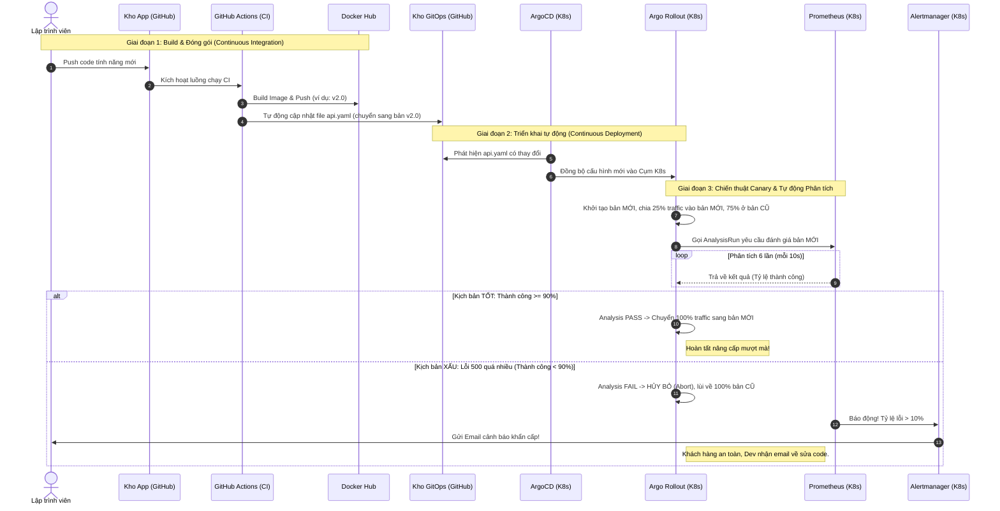

# Luồng Chạy Tổng Thể: Từ Code Đến K8s (GitOps & Auto-Canary)

Để dễ nhìn hơn, sếp xem biểu đồ Tuần tự (Sequence Diagram) dưới đây nhé. Biểu đồ này thể hiện rõ ràng từng bước theo dòng thời gian, không bị rối mắt như biểu đồ khối:

