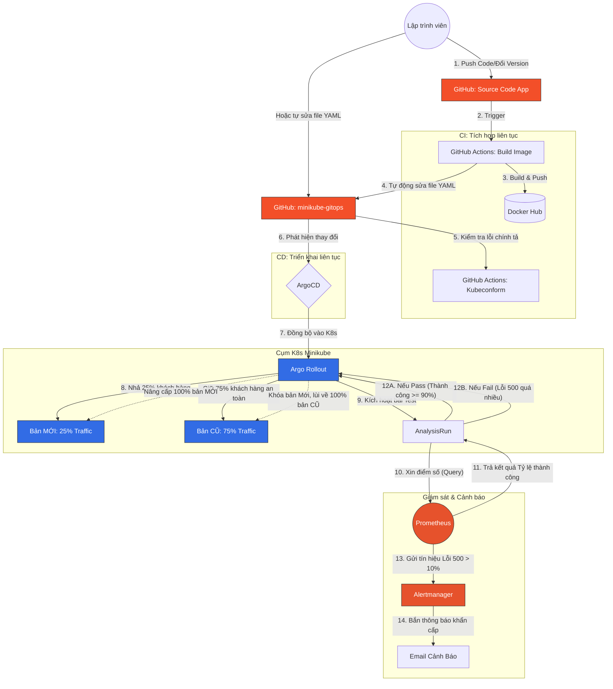

# Luồng Chạy Tổng Thể: Từ Code Đến K8s (GitOps & Auto-Canary)

---

### 📖 GIẢI NGHĨA CHI TIẾT TỪNG BƯỚC:

**Giai đoạn 1: Lập trình viên code (Bước 1 - 5)**
- Sếp code xong tính năng mới, đẩy code lên Github (Kho App).
- Máy móc trên Github (GitHub Actions) lập tức lấy code đi gói lại thành Docker Image, ném lên kho chứa Docker Hub.
- Sau đó, hệ thống CI sẽ tự động chui sang kho `minikube-gitops`, sửa file `api.yaml` để cập nhật tên phiên bản Image mới nhất. (Nhiệm vụ kiểm tra lỗi chính tả Kubeconform cũng tự động chạy ở bước này để đảm bảo file YAML không bị sai).

**Giai đoạn 2: Bác bảo vệ ArgoCD làm việc (Bước 6 - 7)**
- ArgoCD (được cài trong K8s) luôn luôn theo dõi kho Git `minikube-gitops`. Khi phát hiện ra kho này vừa có sự thay đổi cấu hình.
- Nó lập tức lôi cấu hình mới về K8s và ra lệnh cập nhật bằng cách giao việc cho **Argo Rollout**.

**Giai đoạn 3: Chiến thuật thả mìn Canary (Bước 8 - 11)**
- Thay vì xóa hết ứng dụng cũ để cài ứng dụng mới, Argo Rollout chỉ cấp phát **25%** lượng truy cập (khách hàng) vào phiên bản MỚI, **75%** khách hàng còn lại vẫn dùng phiên bản CŨ cho an toàn.
- Lúc này, bài test **AnalysisRun** được kích hoạt. Nó sẽ liên tục hỏi hệ thống Camera giám sát (**Prometheus**) xem: *"Trong 1 phút vừa qua, 25% khách hàng dùng phiên bản mới này tỷ lệ thành công là bao nhiêu?"*.

**Giai đoạn 4: Phán xét và Xử lý sự cố (Bước 12 - 14)**
Sẽ có 2 kịch bản xảy ra ở điểm nghẽn sinh tử này:
- **Kịch bản Tốt (12A):** Prometheus báo cáo tỷ lệ thành công là 100%. Analysis thông qua. Rollout tự tin mở khóa đưa 100% khách hàng sang phiên bản mới. Quy trình hoàn tất mượt mà!
- **Kịch bản Xấu (12B - Lỗi 500 do code hỏng):** Prometheus báo cáo tỷ lệ thành công bị tụt xuống dưới mức quy định (dưới 90%). 
  - Analysis lập tức ra quyết định **ĐÁNH TRƯỢT (Fail)**.
  - Rollout nhận lệnh Fail, lập tức **khóa họng** bản MỚI lại, chuyển 100% lượng truy cập quay lại bản CŨ một cách chớp nhoáng (Auto-Rollback). Khách hàng không hề nhận ra hệ thống vừa gặp sự cố nghiêm trọng.
  - Cùng lúc đó, Prometheus báo cáo thẳng cho **Alertmanager** về việc tỷ lệ lỗi tăng cao bất thường. Alertmanager tự động soạn 1 email khẩn cấp gửi vào hộp thư của nhóm DevOps báo động: *"Hệ thống vừa có lỗi và đã tự động khóa bản cập nhật lại!"*.
