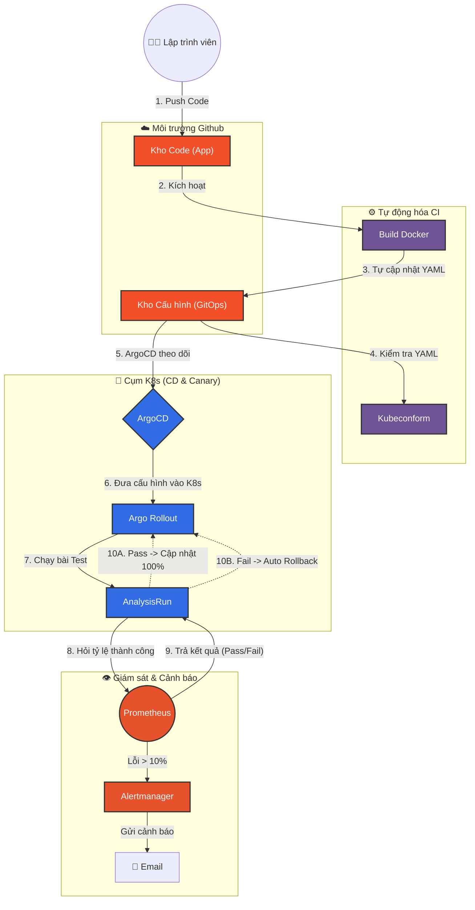

# Luồng Chạy Tổng Thể: Từ Code Đến K8s (GitOps & Auto-Canary)

Sơ đồ khối đã được làm lại cho gọn gàng, các mũi tên ngắn gọn dễ nhìn hơn ạ:

```mermaid
graph TD
    classDef git fill:#f34f29,color:white,stroke:#333,stroke-width:2px
    classDef k8s fill:#326ce5,color:white,stroke:#333,stroke-width:2px
    classDef monitor fill:#e6522c,color:white,stroke:#333,stroke-width:2px
    classDef ci fill:#6e5494,color:white,stroke:#333,stroke-width:2px

    Dev(("👨‍💻 Lập trình viên"))

    subgraph Github ["☁️ Môi trường Github"]
        GitApp["Kho Code (App)"]:::git
        GitOps["Kho Cấu hình (GitOps)"]:::git
    end

    subgraph CI ["⚙️ Tự động hóa CI"]
        GH_App["Build Docker"]:::ci
        GH_Ops["Kubeconform"]:::ci
    end

    Dev -- "1. Push Code" --> GitApp
    GitApp -- "2. Kích hoạt" --> GH_App
    GH_App -- "3. Tự cập nhật YAML" --> GitOps
    GitOps -- "4. Kiểm tra YAML" --> GH_Ops

    subgraph K8s ["🚢 Cụm K8s (CD & Canary)"]
        ArgoCD{"ArgoCD"}:::k8s
        Rollout["Argo Rollout"]:::k8s
        Analysis["AnalysisRun"]:::k8s
        
        ArgoCD -- "6. Đưa cấu hình vào K8s" --> Rollout
        Rollout -- "7. Chạy bài Test" --> Analysis
    end

    GitOps -- "5. ArgoCD theo dõi" --> ArgoCD

    subgraph Monitor ["👁️ Giám sát & Cảnh báo"]
        Prom(("Prometheus")):::monitor
        Alert["Alertmanager"]:::monitor
        Email["📧 Email"]
        
        Analysis -- "8. Hỏi tỷ lệ thành công" --> Prom
        Prom -- "9. Trả kết quả (Pass/Fail)" --> Analysis
        
        Prom -- "Lỗi > 10%" --> Alert
        Alert -- "Gửi cảnh báo" --> Email
    end
    
    Analysis -. "10A. Pass -> Cập nhật 100%" .-> Rollout
    Analysis -. "10B. Fail -> Auto Rollback" .-> Rollout
```
