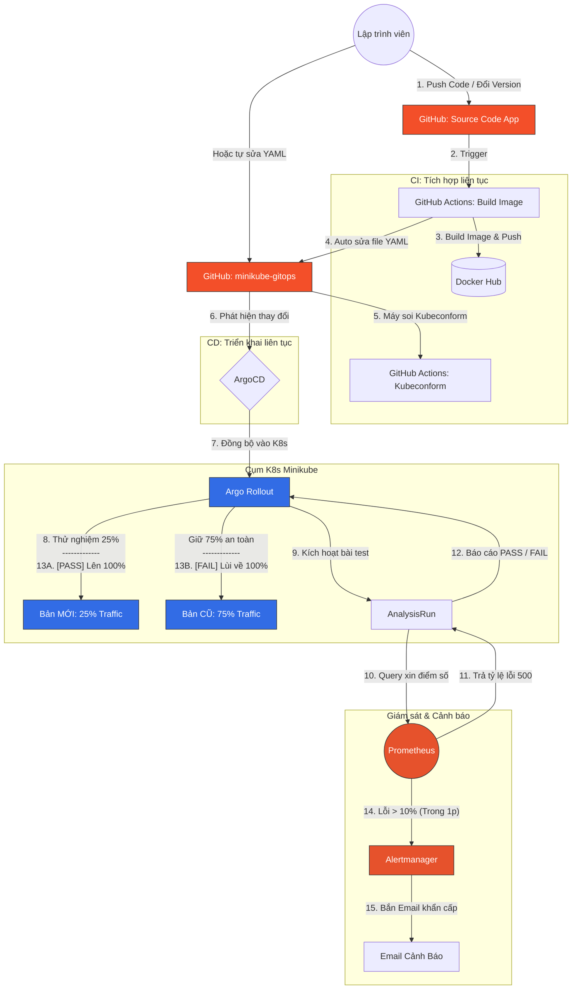

# Luồng Chạy Tổng Thể: Từ Code Đến K8s (GitOps & Auto-Canary)

```mermaid
graph TD
    %% Định nghĩa các khối
    Dev(("Lập trình viên"))
    GitApp["GitHub: Source Code App"]
    GitOps["GitHub: minikube-gitops"]
    
    subgraph CI_Pipeline ["CI: Tích hợp liên tục"]
        GH_App["GitHub Actions: Build Image"]
        DockerHub[("Docker Hub")]
        GH_Ops["GitHub Actions: Kubeconform"]
    end
    
    subgraph CD_Pipeline ["CD: Triển khai liên tục"]
        ArgoCD{"ArgoCD"}
    end
    
    subgraph K8s_Cluster ["Cụm K8s Minikube"]
        Rollout["Argo Rollout"]
        Canary["Bản MỚI: 25% Traffic"]
        Stable["Bản CŨ: 75% Traffic"]
        Analysis["AnalysisRun"]
    end
    
    subgraph Observability ["Giám sát & Cảnh báo"]
        Prometheus(("Prometheus"))
        AlertManager["Alertmanager"]
        Email["Email Cảnh Báo"]
    end

    %% Luồng chạy thực tế
    Dev -->|"1. Push Code / Đổi Version"| GitApp
    GitApp -->|"2. Trigger"| GH_App
    GH_App -->|"3. Build Image & Push"| DockerHub
    GH_App -->|"4. Auto sửa file YAML"| GitOps
    
    Dev -->|"Hoặc tự sửa YAML"| GitOps
    GitOps -->|"5. Máy soi Kubeconform"| GH_Ops
    
    GitOps -->|"6. Phát hiện thay đổi"| ArgoCD
    ArgoCD -->|"7. Đồng bộ vào K8s"| Rollout
    
    Rollout --->|"8. Thử nghiệm 25%<br>-------------<br>13A. [PASS] Lên 100%"| Canary
    Rollout --->|"Giữ 75% an toàn<br>-------------<br>13B. [FAIL] Lùi về 100%"| Stable
    
    Rollout --->|"9. Kích hoạt bài test"| Analysis
    Analysis --->|"10. Query xin điểm số"| Prometheus
    Prometheus --->|"11. Trả tỷ lệ lỗi 500"| Analysis
    Analysis --->|"12. Báo cáo PASS / FAIL"| Rollout
    
    Prometheus --->|"14. Lỗi > 10% (Trong 1p)"| AlertManager
    AlertManager --->|"15. Bắn Email khẩn cấp"| Email
    
    classDef git fill:#f34f29,color:white,stroke:#333
    classDef k8s fill:#326ce5,color:white,stroke:#333
    classDef monitor fill:#e6522c,color:white,stroke:#333
    class GitApp,GitOps git
    class Rollout,Canary,Stable k8s
    class Prometheus,AlertManager monitor
```

---

