# Báo Cáo Thực Hành: GitOps & Ship Smartly (ArgoCD, Rollouts, Canary & SLO)

Tài liệu này tổng hợp chi tiết từng bước thực hành từ việc dựng cụm cơ bản đến thiết lập hệ thống CI/CD & Observability hoàn chỉnh, tuân thủ nghiêm ngặt nguyên tắc GitOps (Mã nguồn là nguồn sự thật duy nhất).

---

## PHẦN 1: NỀN TẢNG GITOPS (BUỔI SÁNG)

### Lab 0: Khởi tạo Cụm và Đẩy Code lên Git
**Mục tiêu:** Cài đặt môi trường Kubernetes cơ bản bằng Minikube để làm nơi chạy ứng dụng, và thiết lập kho lưu trữ mã nguồn trên GitHub.
**Các bước chi tiết:**
1. **Khởi tạo cụm K8s local:** 
   - Lệnh `minikube start -p w9 --driver=docker` sẽ dùng Docker để tạo ra một container đóng vai trò như một máy ảo Node của Kubernetes.
   - Lệnh `kubectl config use-context w9` đảm bảo Terminal của ta đang trỏ đúng vào cụm vừa tạo.
2. **Khởi tạo thư mục dự án:** 
   - Tạo thư mục `minikube-gitops` trên máy tính. Đây sẽ là nơi chứa toàn bộ mã nguồn cấu hình hạ tầng. Gõ lệnh `git init` để biến nó thành một Git repository nội bộ.
3. **Đẩy mã nguồn lên GitHub:**
   - Dùng chuỗi lệnh sau để đóng gói các file hiện tại và đẩy lên một repo trống trên Github đã tạo trước đó:
     ```bash
     git add . 
     git commit -m "init"
     git branch -M main
     git remote add origin https://github.com/dragoncoil2609/minikube-gitops.git
     git push -u origin main
     ```

### Lab 1: Cài đặt ArgoCD vào Cụm
**Mục tiêu:** Cài đặt ArgoCD - một công cụ GitOps Controller liên tục theo dõi sự thay đổi trên Git và áp dụng nó xuống cụm K8s.
**Các bước chi tiết:**
1. **Cài đặt ArgoCD:**
   - Tạo một "không gian riêng" cho ArgoCD: `kubectl create ns argocd`.
   - Áp dụng bộ file cài đặt khổng lồ của ArgoCD. Chú ý phải dùng cờ `--server-side` vì các file CRD (Custom Resource Definition) của ArgoCD quá dài, nếu apply client-side bình thường sẽ bị lỗi vượt quá dung lượng annotation của Kubernetes.
     ```bash
     kubectl apply --server-side -n argocd -f https://raw.githubusercontent.com/argoproj/argo-cd/stable/manifests/install.yaml
     ```
2. **Truy cập giao diện UI:**
   - Vì ArgoCD chạy ngầm trong cụm, ta phải dùng lệnh mở cổng (port-forward) để map cổng 443 của dịch vụ ra cổng 8080 trên máy tính cá nhân:
     ```bash
     kubectl port-forward svc/argocd-server -n argocd 8080:443
     ```
3. **Lấy mật khẩu đăng nhập:**
   - Mật khẩu mặc định được mã hóa Base64 và lưu trong Secret. Lệnh dưới đây sẽ trích xuất mật khẩu và giải mã nó thành dạng text thường để đăng nhập với user `admin`:
     ```bash
     kubectl -n argocd get secret argocd-initial-admin-secret -o jsonpath='{.data.password}' | base64 -d
     ```

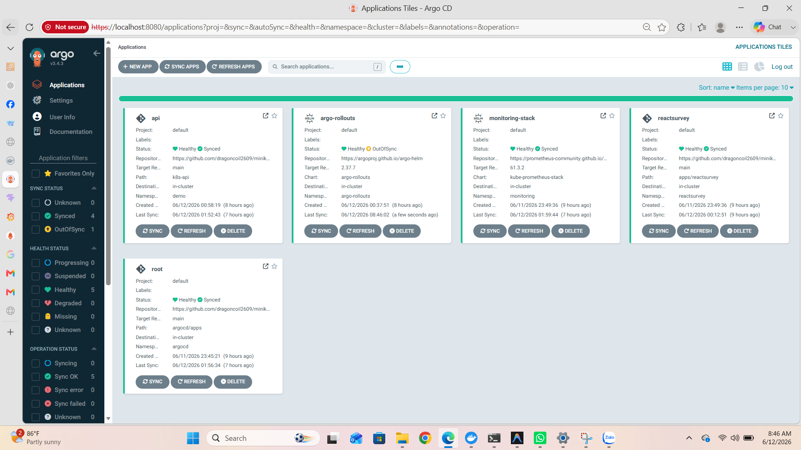

### Lab 2 & 3: Khởi tạo Application & Tính năng Self-Heal
**Mục tiêu:** Cho ArgoCD biết cần phải theo dõi thư mục nào trên Git, và chứng minh tính năng tự động bảo vệ hệ thống khỏi sự can thiệp thủ công (Self-Heal).
**Các bước chi tiết:**
1. **Định nghĩa ứng dụng (Application):**
   - Tạo file `argocd/apps/reactsurvey.yaml` để hướng dẫn ArgoCD: "Hãy lên repo GitHub này, vào thư mục `apps/reactsurvey`, đọc tất cả file YAML trong đó và cài đặt chúng vào namespace `reactsurvey` trên cụm hiện tại".
   - Hai cài đặt quan trọng nhất nằm ở phần `syncPolicy`:
     - `prune: true`: Nếu trên Git xóa 1 file, ArgoCD sẽ tự động xóa resource tương ứng trên K8s (dọn rác).
     - `selfHeal: true`: Nếu cấu hình thực tế trên K8s bị ai đó sửa tay làm lệch với Git, ArgoCD sẽ ngay lập tức ép nó quay về đúng như bản gốc trên Git.
2. **Apply lần đầu:** 
   - Chạy lệnh `kubectl apply -f argocd/apps/reactsurvey.yaml`. Ngay lập tức ArgoCD sẽ bắt đầu quá trình đồng bộ (Sync) ứng dụng lên UI.
3. **Kiểm thử Sync (Đồng bộ xuôi):** 
   - Thay đổi số lượng `replicas: 4` trong file deployment trên máy, commit và push lên Git. Khoảng 3 phút sau (hoặc khi bấm Refresh), ArgoCD sẽ thấy sự thay đổi, trạng thái chuyển thành OutOfSync và nó sẽ tự động tăng số Pod lên 4.
4. **Kiểm thử Self-Heal (Chữa lành ngược):** 
   - Thử mở Terminal đóng vai một kẻ phá hoại, gõ lệnh `kubectl scale deploy frontend -n reactsurvey --replicas=9`.
   - Lập tức Kubernetes nâng số Pod lên 9. Nhưng chưa đầy vài giây sau, ArgoCD quét qua thấy 9 khác với 4 trên Git. Nó lập tức ra lệnh Terminating (xóa) 5 Pod thừa, đưa hệ thống về lại đúng 4 Pod gốc.

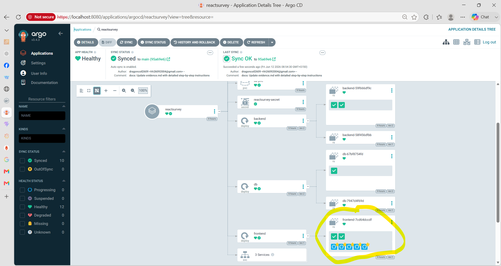

### Lab 4: Rollback An Toàn Qua Git
**Mục tiêu:** Xử lý sự cố bằng cách lùi phiên bản ứng dụng về bản ổn định trước đó, nhưng phải tuân thủ chuẩn mực GitOps (không làm mất dấu vết lịch sử).
**Các bước chi tiết:**
1. **Lùi phiên bản an toàn:**
   - Trong K8s truyền thống, ta hay dùng `kubectl rollout undo`. Nhưng cách này làm K8s bị lệch với Git.
   - Với GitOps, nguồn sự thật duy nhất là Git. Muốn sửa trên K8s, ta phải sửa trên Git. Ta dùng lệnh `git revert HEAD --no-edit` để tạo ra một commit mới có nội dung đảo ngược lại hoàn toàn commit vừa gây ra lỗi.
   - Sau đó `git push` lên GitHub.
2. **Kết quả:**
   - ArgoCD phát hiện ra commit mới (chứa nội dung của phiên bản cũ an toàn), nó tiến hành Sync và cập nhật các resource lùi lại.
   - Cách làm này đảm bảo tính minh bạch tuyệt đối: Trên lịch sử Git sẽ lưu lại rõ ràng "Ai là người lùi code, lùi lúc mấy giờ, lý do là Revert lại commit lỗi nào".

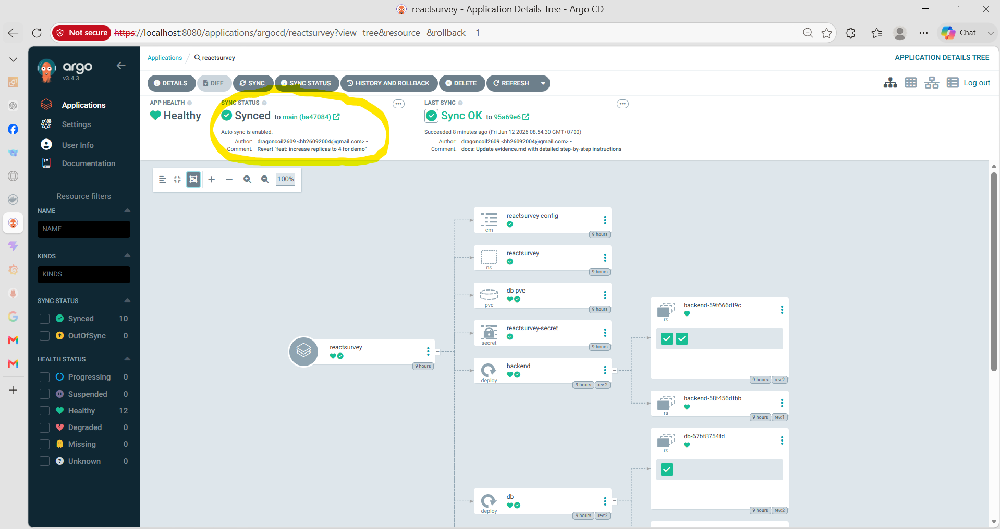

### Lab 5: Mô Hình App-of-Apps (Root Application)
**Mục tiêu:** Quản lý tập trung hàng chục/hàng trăm ứng dụng chỉ thông qua 1 điểm duy nhất (Root). Từ bỏ hoàn toàn việc phải gõ lệnh `kubectl apply` mỗi khi có app mới.
**Các bước chi tiết:**
1. **Tạo Root Application:**
   - Thay vì tạo Application trỏ vào thư mục code, ta tạo một Application đặc biệt tên là `root`, trỏ vào thư mục `argocd/apps` (nơi chứa các file khai báo Application khác).
2. **Kích hoạt:** 
   - Chỉ cần `kubectl apply` đúng 1 file `root.yaml` này duy nhất 1 lần trong đời.
3. **Hiệu ứng dây chuyền:** 
   - Từ giây phút này trở đi, mỗi khi dự án có thêm một vi dịch vụ mới, kỹ sư chỉ cần viết file khai báo Application thả vào thư mục `argocd/apps` và Push lên Git. Root App sẽ phát hiện file mới, tự động đẻ ra một Child App trên ArgoCD, và Child App đó lại tự động kéo code về để dựng lên vi dịch vụ. Toàn bộ là tự động hóa 100%.

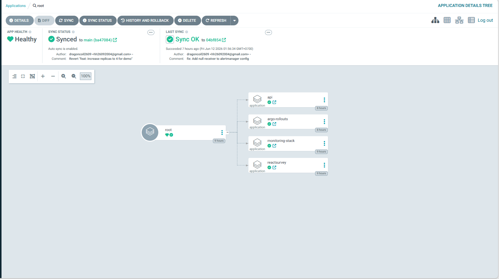

### Lab 6: Sync Waves (Thứ Tự Triển Khai)
**Mục tiêu:** Giải quyết bài toán phụ thuộc vòng (Race condition). Ví dụ: Ứng dụng khởi động lên sẽ bị lỗi CrashLoopBackOff nếu Secret chứa mật khẩu database chưa được tạo ra trước đó.
**Các bước chi tiết:**
1. **Định nghĩa Wave (Đợt sóng):**
   - Ta sẽ chèn thêm annotation `argocd.argoproj.io/sync-wave` vào phần metadata của các file YAML. Số càng nhỏ thì chạy càng sớm. ArgoCD sẽ chờ các resource ở Wave trước chạy thành công (Healthy) thì mới cài tiếp Wave sau.
2. **Quy hoạch thứ tự:**
   - `namespace.yaml` -> `sync-wave: "-1"` (Luôn chạy đầu tiên để tạo chuồng chứa các thành phần khác).
   - `secret.yaml` -> `sync-wave: "0"` (Tạo mật khẩu và config rải sẵn).
   - `deployment.yaml` -> `sync-wave: "1"` (Tạo Pods, vì đã có sẵn namespace và secret nên Pod khởi động mượt mà không vấp lỗi).
   - `service.yaml` -> `sync-wave: "2"` (Cuối cùng mới mở mạng kết nối nội bộ).

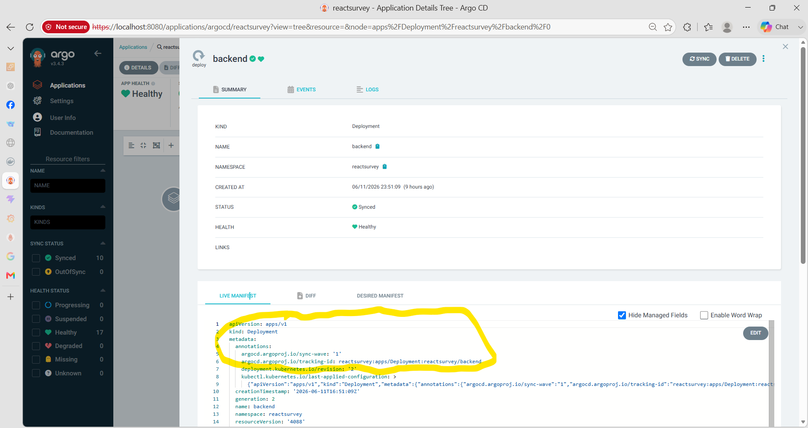

### Lab 7: CI (Continuous Integration) Kiểm Tra Mã Nguồn
**Mục tiêu:** Xây dựng chốt chặn bảo vệ cổng Git. Không cho phép gộp (Merge) các đoạn mã YAML sai cú pháp vào nhánh chính, tránh việc ArgoCD lấy rác về cài làm hỏng hệ thống.
**Các bước chi tiết:**
1. **Tạo luồng kiểm tra (Workflow):**
   - Khai báo file `.github/workflows/validate.yml`. Workflow này sử dụng công cụ `kubeconform` để quét qua toàn bộ file YAML. Công cụ này sẽ đối chiếu từng dòng code với lược đồ chuẩn (schema) của Kubernetes để tìm lỗi sai chính tả, lùi đầu dòng sai, hoặc gọi sai tên trường.
2. **Thiết lập Branch Protection:**
   - Lên giao diện Settings của kho lưu trữ GitHub, bật tính năng bảo vệ cho nhánh `main`.
   - Cấu hình bắt buộc (Require status checks to pass before merging): Mọi kỹ sư khi tạo Pull Request đều phải chờ con bot GitHub Actions chạy xong bài test `validate.yml`. Nếu bot báo đỏ (Failed) do file YAML viết sai, nút Merge sẽ bị khóa cứng. Chỉ khi sửa đúng cú pháp, nút Merge mới sáng lên cho phép đi tiếp.

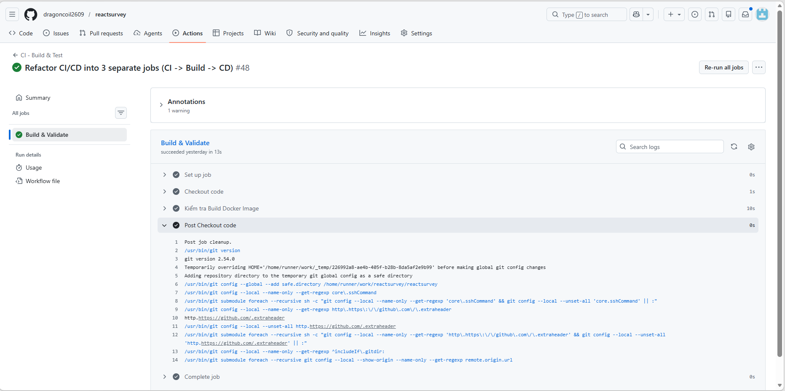

---

## PHẦN 2: OBSERVABILITY & CANARY (BUỔI CHIỀU)

### Lab 8: Cài đặt Argo Rollouts & Prometheus qua GitOps
**Mục tiêu:** Trang bị cho cụm Kubernetes các vũ khí hạng nặng: Argo Rollouts để hỗ trợ phát hành nâng cao, và Prometheus để giám sát, thu thập số liệu đo lường.
**Các bước chi tiết:**
1. **Khai báo ứng dụng hạ tầng:**
   - Tạo file `argo-rollouts.yaml` và `app-monitoring.yaml` lưu vào thư mục `argocd/apps`. Trong đó `app-monitoring` sẽ trỏ trực tiếp ra ngoài Internet để tải bộ cài Kube-Prometheus-Stack thông qua Helm.
2. **Tự động triển khai:**
   - Push lên Git. Root Application (nhờ cơ chế App-of-Apps ở Lab 5) sẽ nhận diện 2 file mới này và tự động xây dựng lên cả một hệ thống thu thập log/metric khổng lồ cùng với Controller điều khiển Rollout vào trong cụm mà không tốn một giọt mồ hôi gõ lệnh.

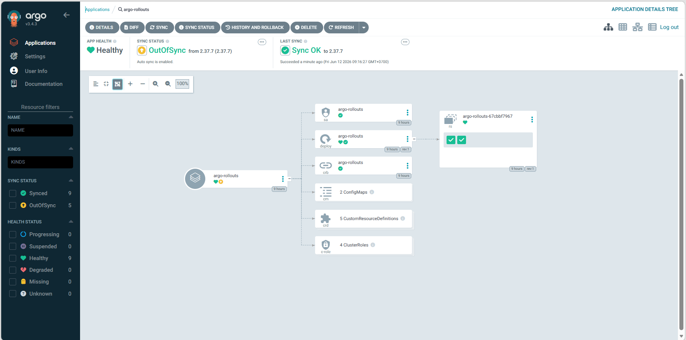

### Lab 9: Chuyển đổi sang Rollout & Cấu hình Canary Thủ Công
**Mục tiêu:** Thay thế kiểu cập nhật thay cũ đổi mới toàn bộ (RollingUpdate của Deployment) bằng chiến thuật Chim Hoàng Yến (Canary): Nhả một lượng nhỏ người dùng sang phiên bản mới để nghe ngóng tình hình, nếu ổn mới cho đi tiếp.
**Các bước chi tiết:**
1. **Khai báo Rollout:**
   - Mở file `api.yaml`, đổi chữ `kind: Deployment` thành `kind: Rollout` (đây là một Custom Resource do Argo Rollouts cung cấp).
2. **Cấu hình chiến thuật:**
   - Thiết lập các bước (steps) cho quá trình Canary:
     ```yaml
     strategy:
       canary:
         steps:
           - setWeight: 25   # Chỉ đưa 25% lượng truy cập vào phiên bản code mới
           - pause: {}       # Lập tức dừng lại vô thời hạn, chờ kỹ sư kiểm tra
     ```
3. **Thao tác điều khiển:**
   - Khi có bản cập nhật mới, Rollout sẽ sinh ra các Pod mới nhưng chỉ điều hướng 25% traffic vào đó. 75% người dùng vẫn chạy trên phiên bản cũ ổn định.
   - Kỹ sư sẽ vào xem log, nếu mọi thứ tốt đẹp, họ gõ lệnh `kubectl argo rollouts promote api -n demo` để gỡ bỏ lệnh pause, tiếp tục đẩy tỷ lệ lên 100%. Nếu thấy lỗi, họ gõ lệnh `abort` để Rollout ngay lập tức vứt bỏ bản mới, đưa toàn bộ 100% traffic về lại bản cũ.

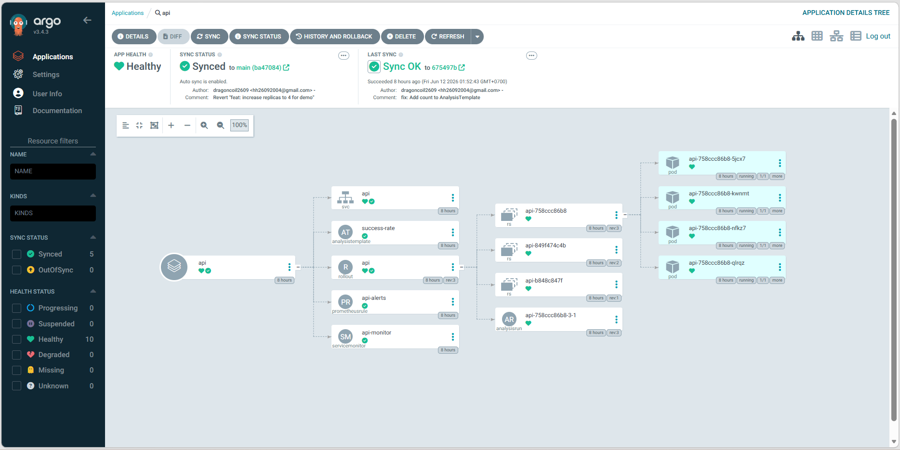

### Lab 10: Auto-Canary (Tự Động Hóa Hoàn Toàn Bằng Analysis)
**Mục tiêu:** Loại bỏ sự can thiệp thủ công (bấm nút promote/abort) của con người ở Lab 9. Để cho hệ thống tự dùng số liệu giám sát (Metrics) chấm điểm bản cập nhật và tự quyết định số phận của nó.
**Các bước chi tiết:**
1. **Định nghĩa tiêu chuẩn (AnalysisTemplate):**
   - Viết file `analysis.yaml` khai báo một công thức toán học truy vấn vào Prometheus để tính tỷ lệ lỗi:
     ```yaml
     successCondition: result[0] >= 0.90 # Điều kiện sinh tử: Tỷ lệ thành công phải >= 90%
     query: |
       sum(rate(flask_http_request_total{status="200"}[1m])) 
       / sum(rate(flask_http_request_total[1m]))
     ```
2. **Tích hợp giám khảo vào quá trình Canary:**
   - Trong file Rollout, ở bước Pause, ta chèn thêm bài test Analysis vào. Giờ đây sau khi đưa 25% traffic vào, thay vì đứng chờ người, nó sẽ đứng chờ kết quả trả về từ Prometheus.
3. **Kịch bản thực tế khi gặp lỗi:**
   - Cố tình sửa code sinh ra lỗi 500 (`ERROR_RATE=0.5`). Khi Rollout tung bản cập nhật này ra mức 25%, máy đo Analysis lập tức chọc vào Prometheus và phát hiện tỷ lệ phản hồi HTTP 200 đã bị rớt thê thảm xuống dưới mốc 90%.
   - Bài test Analysis bị đánh giá là **Failed**.
   - Rollout lập tức chuyển sang trạng thái **Degraded** (Suy thoái), kích hoạt cơ chế phòng vệ **Tự động Abort**. Nó sẽ khóa chặt phiên bản mới, đẩy toàn bộ 100% traffic trở lại phiên bản cũ ngay tắp lự. Hệ thống được bảo vệ an toàn diện rộng mà không cần kỹ sư thức đêm trực hệ thống.

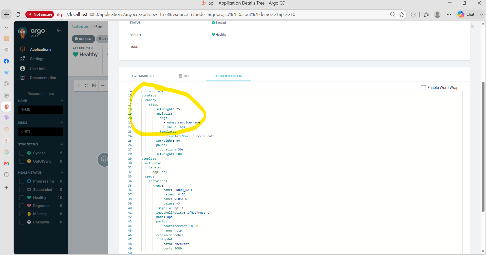
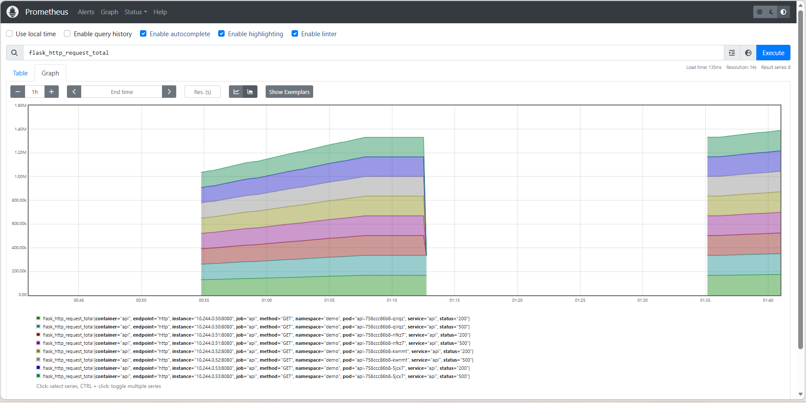


### Lab 11: Thiết Lập Cảnh Báo Lỗi Qua Email (Alertmanager)
**Mục tiêu:** Xây dựng hệ thống báo động đỏ (Alerting). Khi K8s tự động Abort hoặc khi hệ thống có vấn đề, đội ngũ DevOps/SRE phải lập tức nhận được thông báo qua Email để vào điều tra.
**Các bước chi tiết:**
1. **Cấu hình SMTP (Máy chủ gửi thư):**
   - Tinh chỉnh file Values của Helm chart Prometheus Stack để bật tính năng Alertmanager, nhập thông tin máy chủ `smtp.gmail.com:587` và email gửi nhận.
2. **Bảo mật thông tin nhạy cảm:**
   - Nguyên tắc GitOps: Cấm tuyệt đối việc lưu mật khẩu bản rõ trên Git.
   - Lên tài khoản Google tạo một App Password (Mật khẩu ứng dụng 16 ký tự). Sau đó mở Terminal và khởi tạo trực tiếp Secret bảo mật ngay trên cụm K8s:
     ```bash
     kubectl create secret generic alertmanager-secret --from-literal=smtp-password="[APP_PASSWORD]" -n monitoring
     ```
   - Alertmanager sẽ ngầm đọc Secret này để lấy quyền gửi thư.
3. **Thiết lập luật cảnh báo (PrometheusRule):**
   - Tạo file `alert-rules.yaml` để dạy Prometheus cách phát hiện bệnh: "Nếu đo lường thấy API văng lỗi 500 nhiều hơn 5% trong suốt 1 phút liên tục, hãy bắn ra một còi báo động mang tên HighErrorRate".
4. **Kết quả mỹ mãn:**
   - Chạy lệnh kích hoạt một Pod `load-generator` chuyên bắn phá API bằng các request rác.
   - Prometheus đo lường thấy chỉ số lỗi vượt ngưỡng 5%, còi HighErrorRate kêu lên.
   - Alertmanager chộp lấy tiếng còi này, dùng tài khoản SMTP đã cấp quyền, và gửi ngay lập tức một thư khẩn cấp với dải màu đỏ chót tiêu đề "High Error Rate Detected" bay thẳng vào hộp thư Gmail của đội ngũ kỹ sư.

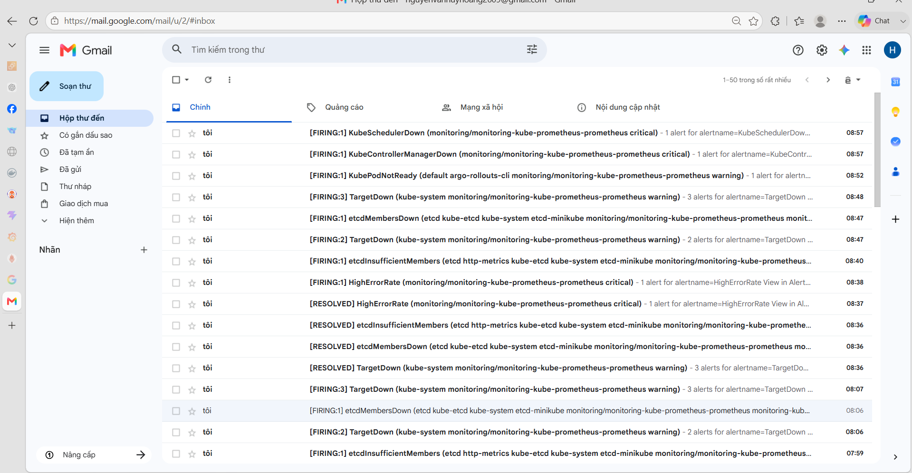
