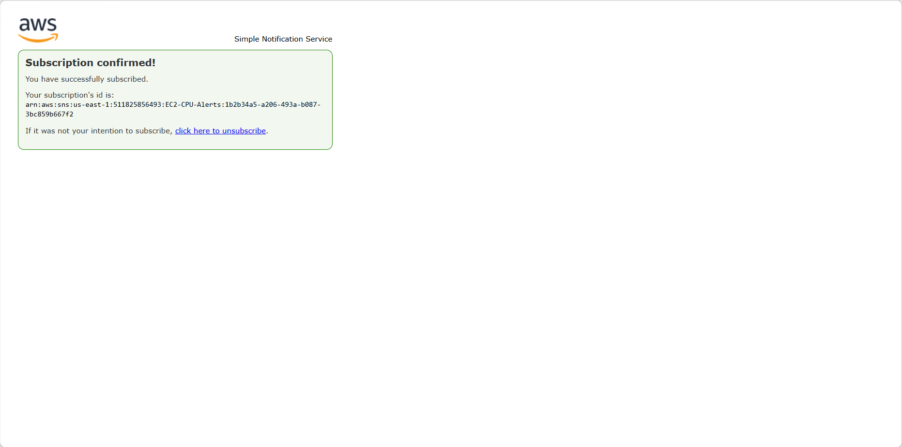
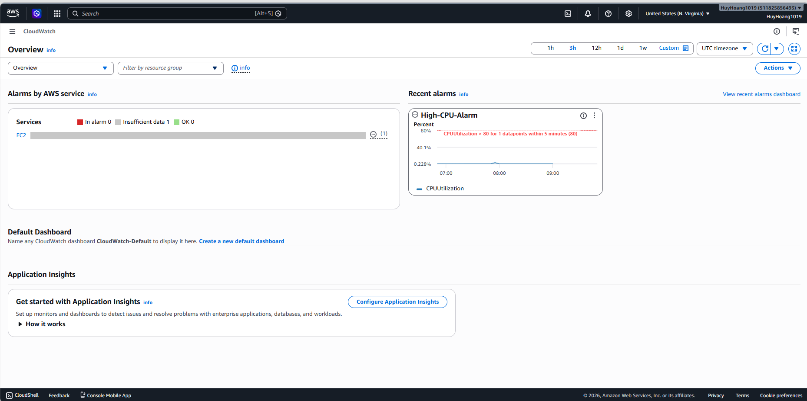
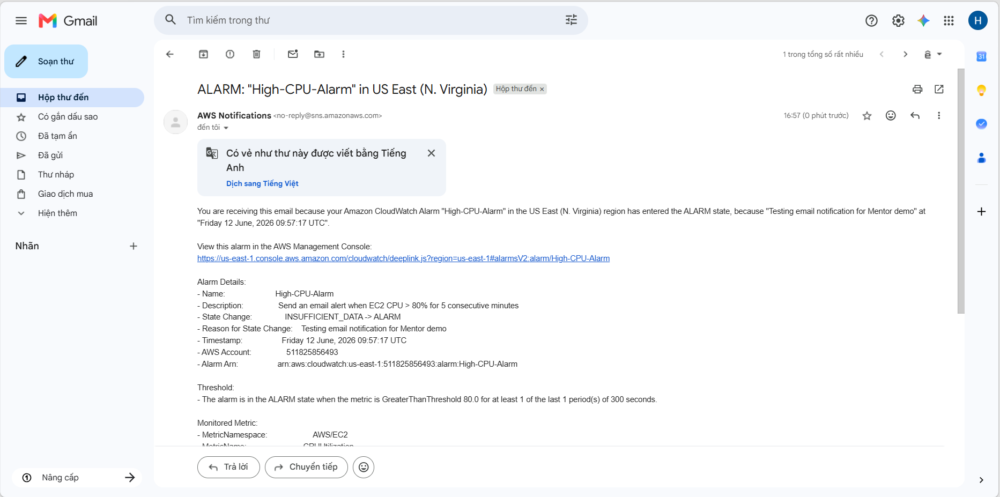
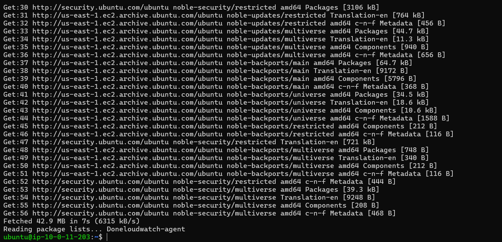

# Kế Hoạch Thực Hành: AWS Monitoring (CloudWatch & SNS)

Dựa vào yêu cầu và hướng dẫn từ hình ảnh bài tập "Homework_CDO_Monitoring", em đã lên kế hoạch chi tiết từng bước để sếp thực hiện và chụp ảnh nộp bài.

## Bài 1: CPU Alarm → Email Alert via SNS
**Mục tiêu:** Gửi email cảnh báo khi CPU của EC2 vượt quá 80% trong 5 phút liên tục.

### Bước 1: Tạo SNS Topic & Subscription
- Truy cập vào giao diện AWS Console -> Mở dịch vụ **SNS (Simple Notification Service)**.
- Chọn **Create Topic**.
  - Type: **Standard**
  - Name: Đặt tên cho topic (VD: `EC2-CPU-Alerts`)
- Sau khi tạo xong, bấm vào tab **Subscriptions** -> **Create subscription**.
  - Protocol: **Email**
  - Endpoint: Nhập địa chỉ email của sếp.
- **Quan trọng:** Mở hộp thư email, tìm email từ AWS và bấm **Confirm subscription** (Chụp ảnh màn hình bước này đã Confirm thành công).


### Bước 2: Tạo CloudWatch Alarm
- Truy cập vào dịch vụ **CloudWatch** -> **Alarms** -> **All alarms** -> **Create alarm**.
- Bấm **Select metric**.
  - Chọn **EC2** -> **Per-Instance Metrics**.
  - Tìm theo Instance ID của con EC2 sếp đang chạy và chọn metric **CPUUtilization**.

### Bước 3: Cấu hình Điều kiện Báo động (Conditions)
- **Metric Name:** CPUUtilization
- **Period:** 5 minutes
- **Conditions:**
  - Threshold type: Static
  - Whenever CPUUtilization is: **Greater/Equal (>=)** hoặc **Greater (>)**
  - than: **80**
- **Datapoints to alarm:** 1 out of 1 (Để mô phỏng cảnh báo sau 5 phút).
- Chụp ảnh màn hình phần cấu hình Metric và Condition này.


### Bước 4: Cấu hình Hành động Gửi Email (Actions)
- Trong bước Configure actions:
  - Alarm state trigger: **In alarm**
  - Send notification to the following SNS topic: Chọn cái SNS Topic `EC2-CPU-Alerts` sếp vừa tạo ở Bước 1.
- (Tùy chọn) Thêm một action nữa cho trạng thái **OK** (Recovery alert) để báo khi CPU giảm xuống.
- Đặt tên cho Alarm (VD: `High-CPU-Alarm`) và tạo.
- (Để test và chụp ảnh nộp bài, sếp có thể cài `stress` vào EC2 để ép CPU lên 100%, sau đó chụp ảnh nhận được Email cảnh báo).


---

## Bài 2: Installing the CloudWatch Agent on EC2
**Mục tiêu:** Cài đặt CloudWatch Agent để thu thập thêm các Log và Metric chuyên sâu từ bên trong con EC2 (như RAM, Disk) đẩy lên CloudWatch.

### Bước 0: (Điều kiện bắt buộc) Gắn IAM Role cho EC2
- Đảm bảo con EC2 của sếp đang được gắn một IAM Role có chứa Policy: **`CloudWatchAgentServerPolicy`**. Nếu chưa có, sếp phải vào IAM tạo Role, gán Policy này, rồi Attach Role vào con EC2 đó.

### Bước 1: Cài đặt gói Agent
Sếp SSH vào con EC2 và chạy lệnh cài đặt:
- **Nếu dùng Amazon Linux:**
  ```bash
  sudo yum install amazon-cloudwatch-agent -y
  ```
- **Nếu dùng Ubuntu:**
  ```bash
  sudo apt-get install amazon-cloudwatch-agent
  ```
- Chụp ảnh màn hình terminal lúc cài đặt thành công.


### Bước 2: Chạy Configuration Wizard (Tạo file cấu hình)
Chạy lệnh sau để khởi động menu hướng dẫn tạo file cấu hình:
```bash
sudo /opt/aws/amazon-cloudwatch-agent/bin/amazon-cloudwatch-agent-config-wizard
```
- Sếp cứ chọn các tùy chọn mặc định (hoặc tùy chỉnh theo ý muốn) để nó sinh ra file config JSON.

### Bước 3: Khởi động Agent
Chạy lệnh sau để Agent tự khởi động cùng hệ thống và bắt đầu chạy:
```bash
sudo systemctl enable amazon-cloudwatch-agent
sudo systemctl start amazon-cloudwatch-agent
```

### Bước 4: Kiểm tra trạng thái Agent
Chạy lệnh sau để xác nhận Agent đang hoạt động bình thường:
```bash
sudo /opt/aws/amazon-cloudwatch-agent/bin/amazon-cloudwatch-agent-ctl -m ec2 -a status
```
- Chụp ảnh màn hình terminal hiển thị chữ `"status": "running"` để nộp bài.


---

