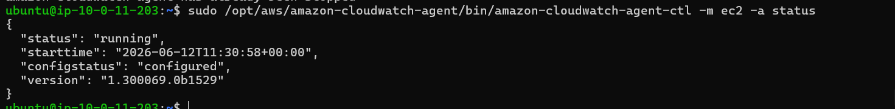
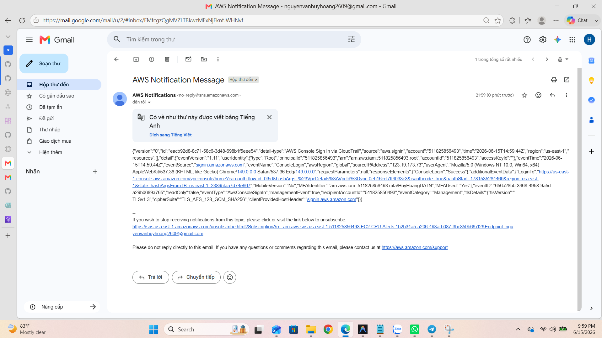

# Kế Hoạch Thực Hành: AWS Monitoring (CloudWatch & SNS)

Tài liệu này trình bày các bước thực hiện cấu hình hệ thống giám sát và cảnh báo trên AWS sử dụng Amazon CloudWatch và Amazon SNS.

## Bài 1: CPU Alarm → Email Alert via SNS
**Mục tiêu:** Gửi email cảnh báo khi mức độ sử dụng CPU của EC2 vượt ngưỡng 80% liên tục trong 5 phút.

### Bước 1: Tạo SNS Topic & Subscription
1. Truy cập giao diện AWS Console và điều hướng đến dịch vụ **SNS (Simple Notification Service)**.
2. Chọn **Create Topic**.
   - Type: **Standard**
   - Name: Đặt tên cho topic (Ví dụ: `EC2-CPU-Alerts`).
3. Sau khi tạo xong, chuyển sang tab **Subscriptions** và chọn **Create subscription**.
   - Protocol: **Email**
   - Endpoint: Nhập địa chỉ email người nhận cảnh báo.
4. Kiểm tra hộp thư đến, tìm email xác nhận từ AWS và tiến hành **Confirm subscription**.


### Bước 2: Tạo CloudWatch Alarm
1. Truy cập dịch vụ **CloudWatch** -> **Alarms** -> **All alarms** -> **Create alarm**.
2. Chọn **Select metric**.
   - Chọn mục **EC2** -> **Per-Instance Metrics**.
   - Lọc theo Instance ID của EC2 cần giám sát và chọn metric **CPUUtilization**.

### Bước 3: Cấu hình Điều kiện Báo động (Conditions)
Thiết lập các thông số cảnh báo theo yêu cầu:
- **Metric Name:** CPUUtilization
- **Period:** 5 minutes
- **Conditions:**
  - Threshold type: Static
  - Whenever CPUUtilization is: **Greater/Equal (>=)** hoặc **Greater (>)**
  - than: **80**
- **Datapoints to alarm:** 1 out of 1.


### Bước 4: Cấu hình Hành động Gửi Email (Actions)
- Tại bước Configure actions:
  - Alarm state trigger: **In alarm**
  - Send notification to the following SNS topic: Lựa chọn SNS Topic `EC2-CPU-Alerts` đã tạo ở Bước 1.
- Tiến hành đặt tên cho Alarm (Ví dụ: `High-CPU-Alarm`) và lưu cấu hình.
- Có thể sử dụng công cụ `stress` trên EC2 hoặc CLI để giả lập cảnh báo và kiểm tra khả năng gửi email.


---

## Bài 2: Installing the CloudWatch Agent on EC2
**Mục tiêu:** Cài đặt CloudWatch Agent để thu thập các số liệu chuyên sâu từ hệ điều hành của EC2 (như Memory, Disk usage) và gửi lên hệ thống CloudWatch.

### Điều kiện tiên quyết: Gắn IAM Role cho EC2
Đảm bảo EC2 đang được phân quyền IAM Role chứa Policy: **`CloudWatchAgentServerPolicy`**. 

### Bước 1: Cài đặt gói phần mềm Agent
Thực hiện kết nối SSH vào EC2 và chạy lệnh cài đặt:

- **Đối với hệ điều hành Amazon Linux:**
  ```bash
  sudo yum install amazon-cloudwatch-agent -y
  ```
- **Đối với hệ điều hành Ubuntu:**
  ```bash
  sudo apt-get update
  sudo apt-get install collectd -y
  wget https://amazoncloudwatch-agent.s3.amazonaws.com/ubuntu/amd64/latest/amazon-cloudwatch-agent.deb
  sudo dpkg -i -E ./amazon-cloudwatch-agent.deb
  ```


### Bước 2: Khởi tạo tệp cấu hình bằng Wizard
Chạy lệnh sau để kích hoạt trình hướng dẫn (wizard) cấu hình:
```bash
sudo /opt/aws/amazon-cloudwatch-agent/bin/amazon-cloudwatch-agent-config-wizard
```
Có thể lựa chọn các thiết lập mặc định bằng cách nhấn Enter. Hệ thống sẽ sinh ra tệp cấu hình JSON tại thư mục cài đặt.

### Bước 3: Kích hoạt Agent với cấu hình vừa tạo
Thực thi lệnh sau để nạp cấu hình (fetch-config) và khởi động CloudWatch Agent:
```bash
sudo /opt/aws/amazon-cloudwatch-agent/bin/amazon-cloudwatch-agent-ctl -a fetch-config -m ec2 -s -c file:/opt/aws/amazon-cloudwatch-agent/bin/config.json
```

### Bước 4: Kiểm tra trạng thái hoạt động của Agent
Xác minh Agent đang chạy bình thường bằng câu lệnh:
```bash
sudo /opt/aws/amazon-cloudwatch-agent/bin/amazon-cloudwatch-agent-ctl -m ec2 -a status
```
Khi cài đặt thành công, trạng thái sẽ hiển thị `"status": "running"`.


---

## Bài 3: Alert on AWS Root Account Login
**Mục tiêu:** Thiết lập hệ thống tự động phát hiện và gửi cảnh báo qua email ngay lập tức khi có người dùng đăng nhập vào tài khoản Root (tài khoản quyền lực nhất) trên giao diện AWS Console.

### Bước 1: Kích hoạt AWS CloudTrail (Tùy chọn, nếu chưa có)
*Lưu ý: EventBridge cần CloudTrail để ghi nhận sự kiện đăng nhập.*
1. Truy cập dịch vụ **CloudTrail** trên AWS Console.
2. Kiểm tra xem đã có Trail nào đang hoạt động chưa. Nếu chưa, chọn **Create trail**.
3. Điền tên cho Trail (Ví dụ: `Management-Events-Trail`) và tạo một S3 bucket mới để lưu trữ log. Đảm bảo Trail này đang ghi nhận các sự kiện quản lý (Management events).

### Bước 2: Tạo Rule trên Amazon EventBridge
1. Điều hướng đến dịch vụ **Amazon EventBridge** -> Chọn **Rules** -> **Create rule**.
2. Đặt tên Rule (Ví dụ: `Root-Login-Alert`). Chọn **Rule type** là **Rule with an event pattern** -> Next.
3. Tại phần **Event pattern**:
   - Event source: **AWS services**
   - AWS service: **AWS Console Sign-in**
   - Event type: **Sign-in Events**
4. Kéo xuống mục **Event pattern** (dạng JSON), nhấn nút **Edit pattern** và dán đoạn mã sau vào để hệ thống chỉ báo động đối với tài khoản Root:
   ```json
   {
     "detail-type": ["AWS Console Sign In via CloudTrail"],
     "source": ["aws.signin"],
     "detail": {
       "userIdentity": {
         "type": ["Root"]
       }
     }
   }
   ```
5. Chọn **Next**.

### Bước 3: Cấu hình Target (Đích đến của cảnh báo)
1. Trong phần **Select target**:
   - Target types: **AWS service**
   - Select a target: **SNS topic**
   - Topic: Lựa chọn lại Topic `EC2-CPU-Alerts` đã tạo ở Bài 1 (Hoặc tạo một Topic mới nếu muốn phân loại riêng).
2. Lựa chọn **Next** và hoàn tất việc tạo Rule (Create rule).


### Bước 4: Kiểm tra cấu hình (Tùy chọn)
1. Đăng xuất khỏi tài khoản IAM hiện tại.
2. Tiến hành đăng nhập lại vào giao diện AWS Console bằng thông tin của **Root user**.
3. Kiểm tra hòm thư email để xác nhận thông báo Root Login đã được gửi thành công.

